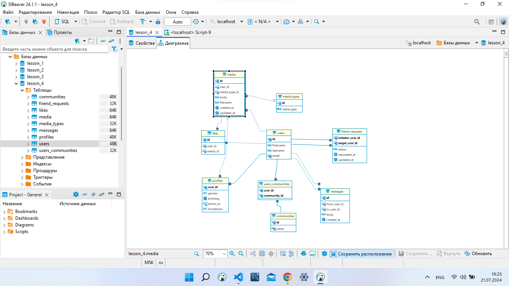
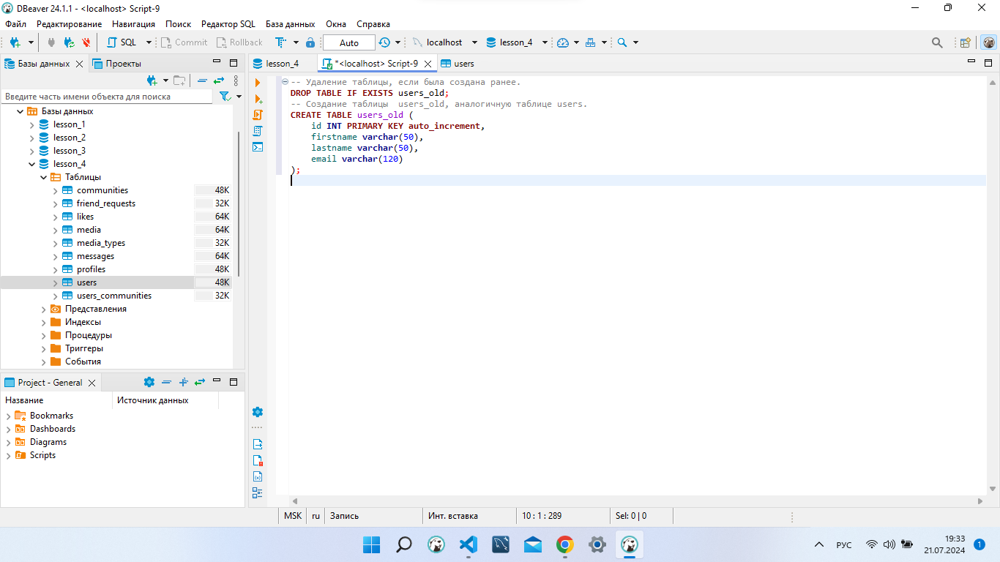
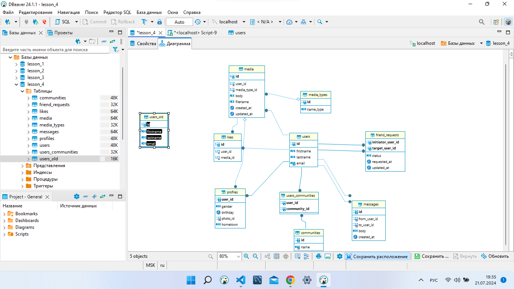
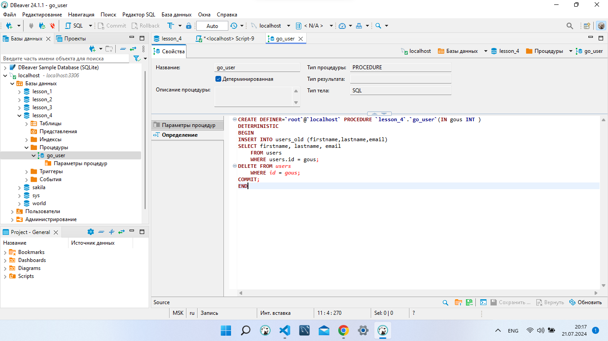
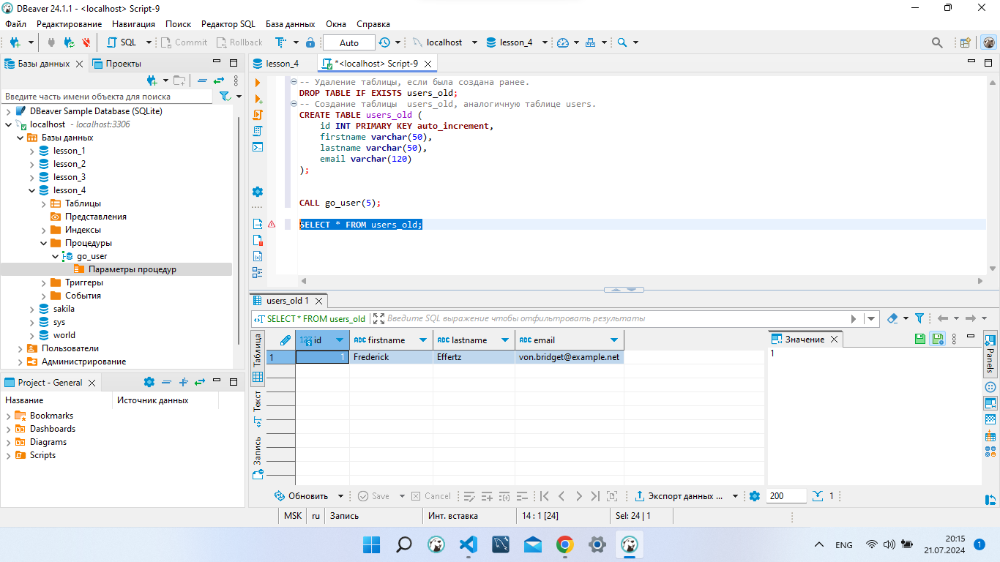
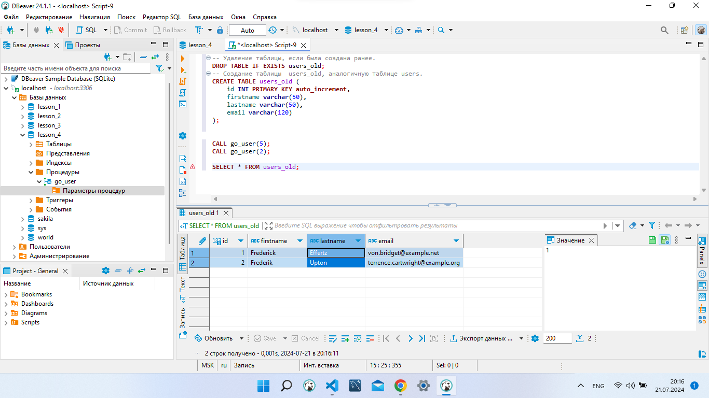
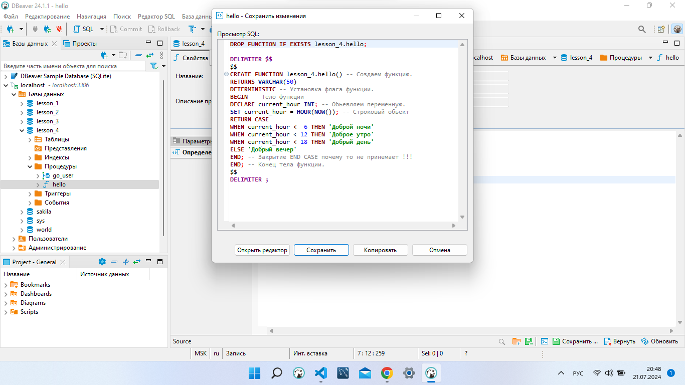
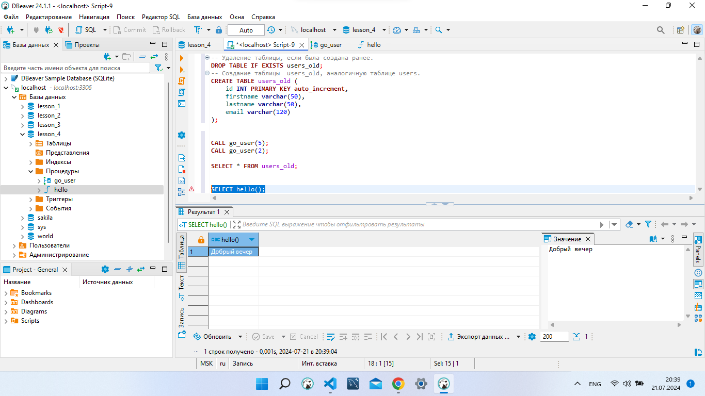

# Final control work on the MySQL block.

## группа № 6014 Зуев Максим 

***
 ### _1.  Создайте таблицу users_old, аналогичную таблице users. Создайте процедуру, с помощью которой можно переместить любого (одного) пользователя из таблицы users в таблицу users_old. (использование транзакции с выбором commit или rollback – обязательно)._

```sql
-- Удаление таблицы, если была создана ранее.
DROP TABLE IF EXISTS users_old;
-- Создание таблицы  users_old, аналогичную таблице users.
CREATE TABLE users_old (
	id INT PRIMARY KEY auto_increment, 
    firstname varchar(50), 
    lastname varchar(50), 
    email varchar(120)
);
```
> **Начальная диаграмма базы данных lesson_4**


> **Скрипт**


> **Конечная база данных c новой таблицей users_old**


**Создаем процедуру, с помощью которой можно переместить любого (одного) пользователя из таблицы users в таблицу users_old.**
```sql
CREATE DEFINER=`root`@`localhost` PROCEDURE `lesson_4`.`go_user`(IN gous INT )
DETERMINISTIC
BEGIN
INSERT INTO users_old (firstname,lastname,email) 
SELECT firstname, lastname, email 
	FROM users 
	WHERE users.id = gous;
DELETE FROM users 
	WHERE id = gous;
COMMIT;
END
```


> **Вводим команду CALL go_user(5);**


> **Вводим команду CALL go_user(2);**
**

***
***


###  _2.  Создайте хранимую функцию hello(), которая будет возвращать приветствие, в зависимости от текущего времени суток. С 6:00 до 12:00 функция должна возвращать фразу "Доброе утро", с 12:00 до 18:00 функция должна возвращать фразу "Добрый день", с 18:00 до 00:00 — "Добрый вечер", с 00:00 до 6:00 — "Доброй ночи"._


**Создаем функцию hello**
```sql
CREATE FUNCTION lesson_4.hello() -- Создаем функцию.
RETURNS VARCHAR(50)  
DETERMINISTIC -- Установка флага функции.
BEGIN -- Тело функции
DECLARE current_hour INT; -- Обьевляем переменную.
SET current_hour = HOUR(NOW()); -- Строковый обьект
RETURN CASE
WHEN current_hour <  6 THEN 'Доброй ночи'
WHEN current_hour < 12 THEN 'Доброе утро'
WHEN current_hour < 18 THEN 'Добрый день'
ELSE 'Добрый вечер'
END; -- Закрытие END CASE почему то не принемает !!!  
END; -- Конец тела функции.
```
> **Функция hello**


**Вызываем функцию командой** 
```sql
SELECT hello();
```

> **Результат функции** 



### _(по желанию)* Создайте таблицу logs типа Archive. Пусть при каждом создании записи в таблицах users, communities и messages в таблицу logs помещается время и дата создания записи, название таблицы, идентификатор первичного ключа."!_


