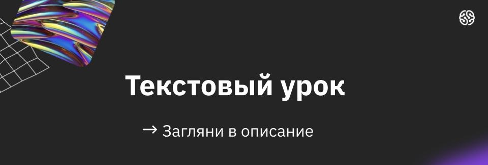

> Домашнее задание. Выполнил студент GB Зуев Максим Михайлович, группа № 6014.
=> [Дипломная работа](./ДИПЛОМНАЯ%20РАБОТА/Дипломная%20работа%20Зуев%20Максим%20Михайлович%20№6014.docx)

# Поздравляем!

## Перед вами Итоговая аттестация и вы на финишной прямой. Вам осталось всего несколько шагов до окончания обучения.

Как будет проходить Итоговая аттестация:
- Урок 1 - это время для подготовки к сдаче итоговой работы. Срок на подготовку - 14 дней.
- Урок 2 вы прикладываете свою работу, которую проверяют по критериям и выставляется финальная оценка. Срок на сдачу работы - 1 день.

❗️Сроки стартуют в момент старта занятия

Для успешного завершения обучения у вас должны быть сданы все Промежуточные аттестации по курсам и Итоговая аттестация.

Если вы еще успеваете сдать итоговую аттестацию, а промежуточные аттестации пропустили, можете загрузить их в форму: https://gb.ru/b/s1_final_project

❗️Сроки стартуют в момент старта занятия

Что нужно сделать, чтобы успешно пройти Итоговую аттестацию:

Убедитесь, что ваша работа соответствует основным требованиям:
1.Тема вашей работы актуальна и имеет практическую значимость.
2. Работа оформлена по шаблону: есть титульный лист, шрифт Times New Roman, кегль 12 или 14, количество страниц 50+, включая приложения.
3.Приложены все необходимые артефакты и рабочие ссылки.
4.Ваша работа удовлетворяет хотя бы 50% критериев из Гайда по Направлению.
5. У работы высокая оригинальность и она не скопирована с работы другого студента; в противном случае эксперт будет вынужден поставить оценку “удовлетворительно”.
