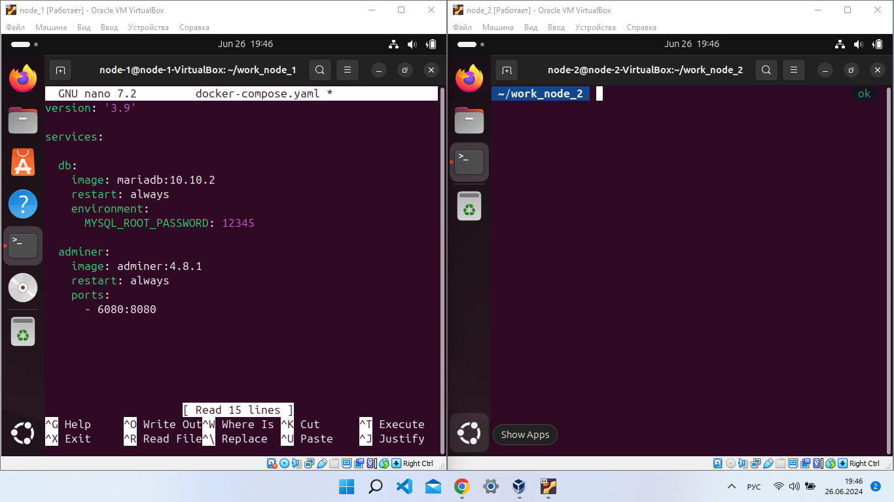

# Control work on the Linux block
## Zuev Maksim Mihailovich groupe №6014
Task 5. Docker Compose и Docker Swarm
```Задание 1:
1) создать сервис, состоящий из 2 различных контейнеров: 1 - веб, 2 - БД
2) далее необходимо создать 3 сервиса в каждом окружении (dev, prod, lab)
3) по итогу на каждой ноде должно быть по 2 работающих контейнера
4) выводы зафиксировать 
```
***
Создаем файл docker-compose.yaml и прописываем туда инструкцию. 



Далее с помощью команды запускаем.

```
sudo docker compose up -d
```


Далее переходим в браузер ip:6080 и вводим связку логин - пороль.


***

Далее необходимо создать 3 сервиса в каждом окружении (dev, prod, lab)

Для решение задачи потребуется две VirtualBox машины "node-1" и "node-2" соедененные между собой подключинием типа NAT или Bridge. 
Создадим две рабочие дериктории 

```
mkdir work_node_1
mkdir work_node_2
```


***
Воспользуемся командой

```
sudo docker swarm init
```
и подключим две машины вместе.


Проверяем что все получилось, стутус Active.

```
sudo docker node ls
```


Cоздаем overlay сеть между node

```
sudo docker network create --driver overlay qzeeVbox --attachable
```

Проверяем созданную сеть на статус overlay

```
sudo docker network ls
```


***

Прописываем labels = dev

``` 
sudo docker node update --label-add env=dev node-1-VirtualBox
```

И запускаем Service на два контейнера

```
sudo docker service create --name nginx_service --replicas 2 -p 3310:3310 --network qzeeVbox --constraint node.labels.env==dev nginx:latest
```

Проверяем что прошло успешно

```
sudo docker service ps nginx_service
```


***

Прописываем labels = prod

```
sudo docker node update --label-add env=prod node-2-VirtualBox
```

И запускаем Service на два контейнера

```
sudo docker service create --name nginx_service2 --replicas 2 -p 3308:3308 --network qzeeVbox --constraint node.labels.env==prod nginx:10.10.1
```

Проверяем что прошло успешно

```
sudo docker service ps nginx_service2
```


***

Прописываем labels = lab

```
sudo docker node update --label-add env=lab node-1-VirtualBox
```

И запускаем Service на два контейнера

```
sudo docker service create --name nginx_service3 --replicas 2 -p 3310:3310 --network qzeeVbox --constraint node.labels.env==lab nginx:latest
```

Проверяем что прошло успешно

```
sudo docker service ps nginx_service3
```


```

sudo docker inspect имя сервиса 
```

Можно посмотреть в формате .json как прописался label 

