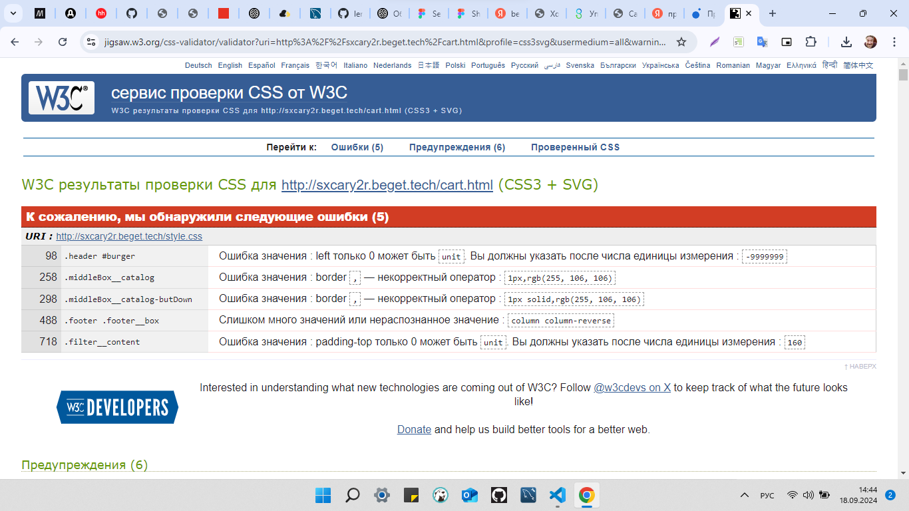
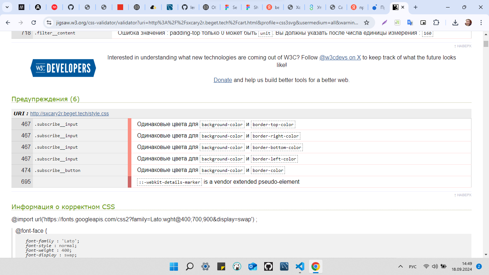
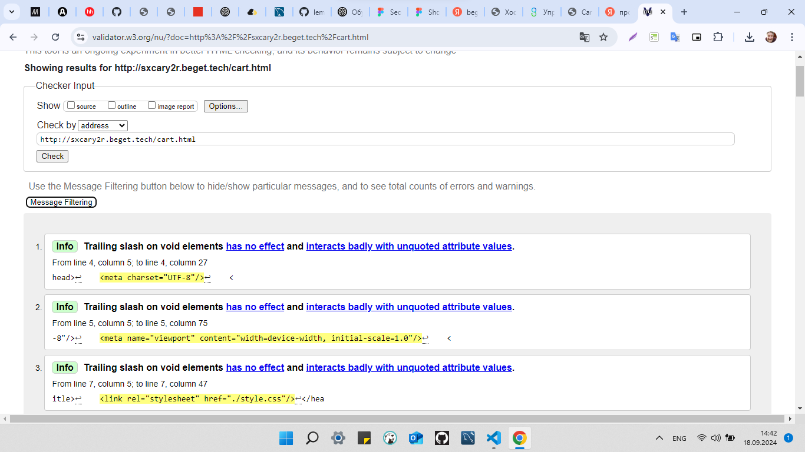
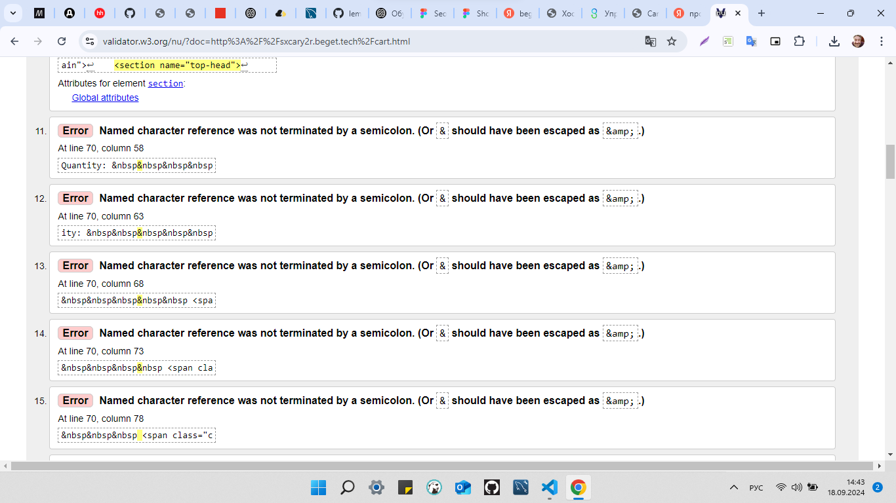
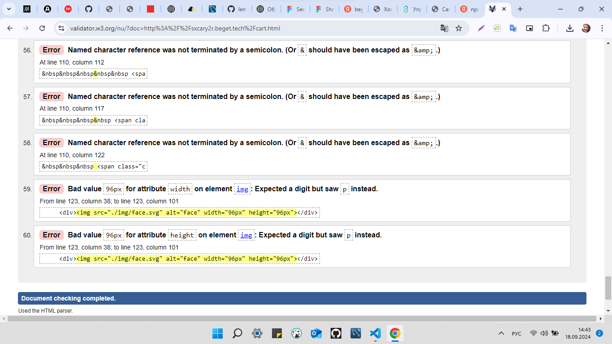

### site  <http://sxcary2r.beget.tech/catalog.html>
Проверка сайта на валидность HTML и CSS/







# Продвинутый HTML + CSS (семинары в записи)

## Урок 6. Продвинутая работа с анимацией, создаем игру на HTML/
```
Создать мобильную версию для всех 5 страниц интернет-магазина
Проверить работу сайта на разрешении 375px
Проверить работу сайта на разрешении 425 px
Проверить сайта на валидность
```
---
```
Данная промежуточная аттестация оценивается по системе "зачет" / "не зачет"
"Зачет" ставится, если слушатель успешно выполнил 3 задания из 4
"Незачет" ставится, если слушатель успешно выполнил менее 3 заданий

Критерии оценивания:
1 - Слушатель создал мобильную версию для всех 5 страниц интернет-магазина
2 - Слушатель проверил работу сайта на разрешении 375px
3- Слушатель проверил работу сайта на разрешении 425 px
4- Слушатель проверил сайт на валидность
```
## Урок 5. Адаптивная вёрстка
```
Создать планшетную версию для всех 5 страниц интернет-магазина
Проверить работу сайта на разрешении 768px
Проверить работу сайта на разрешении 1024 px
```
## Урок 4. Методология БЭМ
```
Создать страницу регистрации
Использовать препроцессоры
Добавлять эффекты наведения на все кнопки и ссылки
Добавлять плавность перехода при наведении на элементы
Адаптив создавать не нужно, только десктопную версию
```

## Урок 2. Новые возможности HTML5


```
Вам необходимо создать страницу каталога
Обязательно использовать препроцессоры
Не забыть добавить выпадающие блоки сортировки
У вас уже есть созданные шапка и подвал сайта, данные элементы должны быть переиспользованы с главной страницы интернет-магазина
Адаптив создавать не нужно, только десктопную версию
```

## Урок 1. Препроцессоры
```
В предыдущем курсе вам удалось реализовать главную страницу интернет-магазина. Вам необходимо открыть данный проект Устанавливаем 3 расширения (Если вы этого не сделали на семинаре) a. Live Sass Compiler b. Sass c. Live Server
Перевести все стили из css в SCSS
Приступаем к созданию страницы каталога
Не забываем, что у вас уже готова шапка сайта и подвал страницы, плюс у вас уже есть блок из 3х товаров, осталось добавить изображение и под ним описание
Адаптив создавать не нужно, только десктопную версию.
```