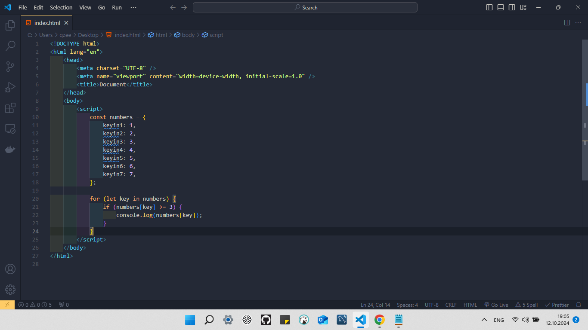
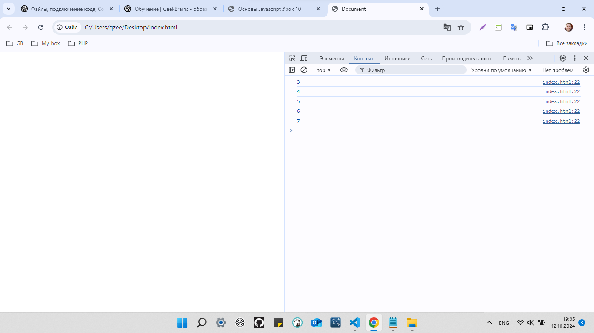
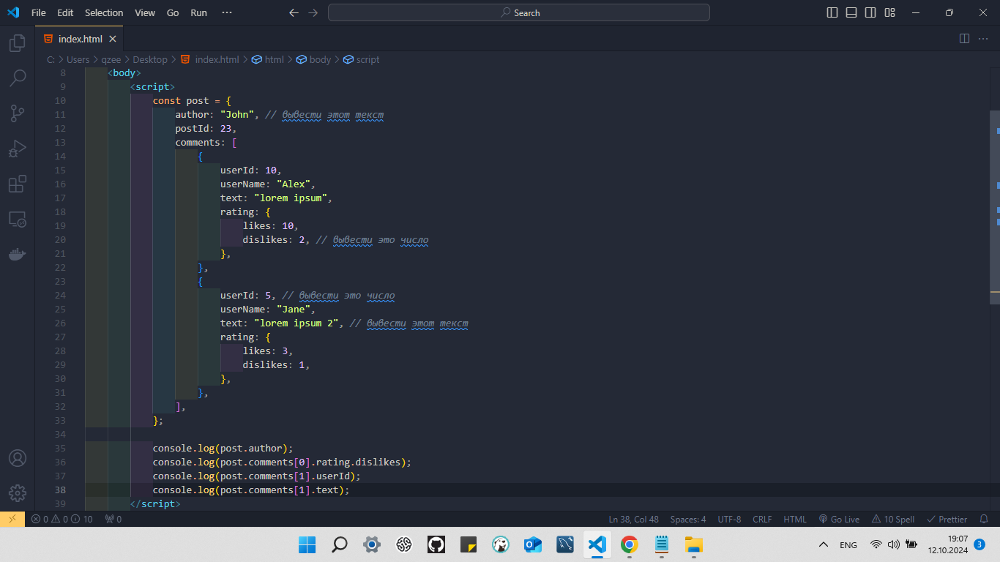
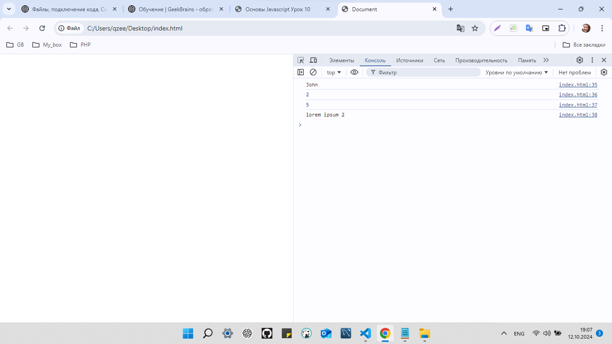
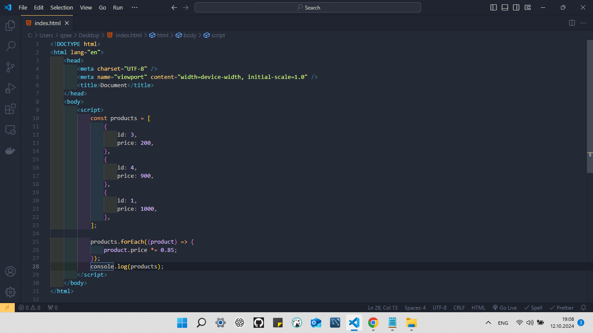
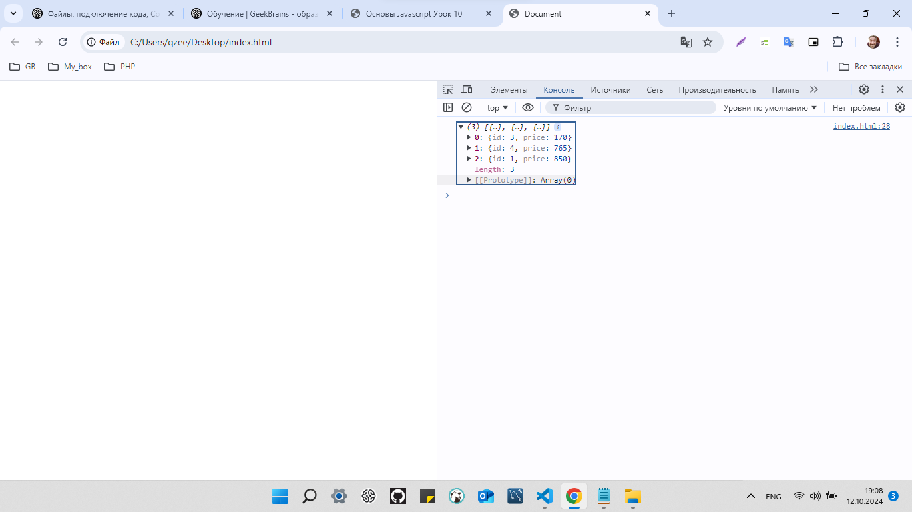
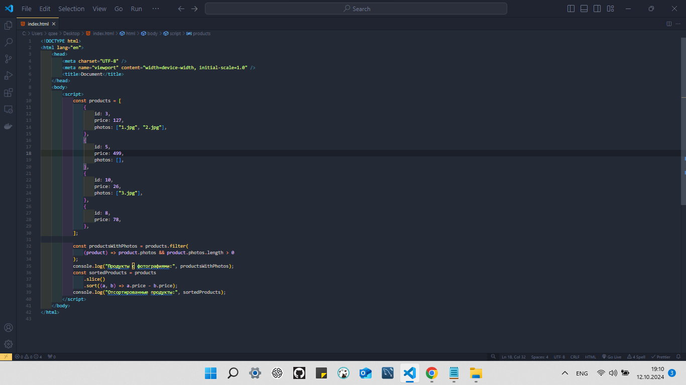
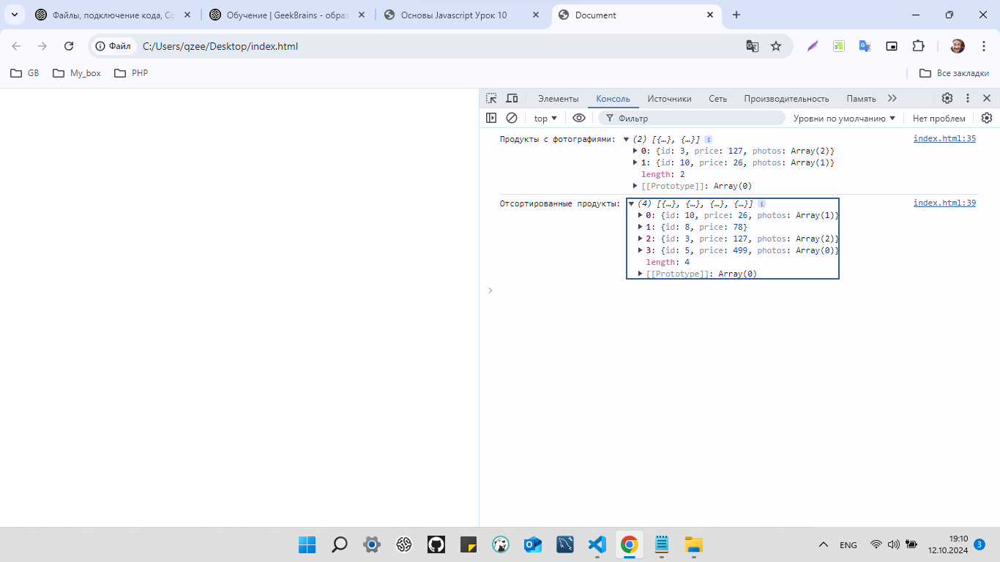
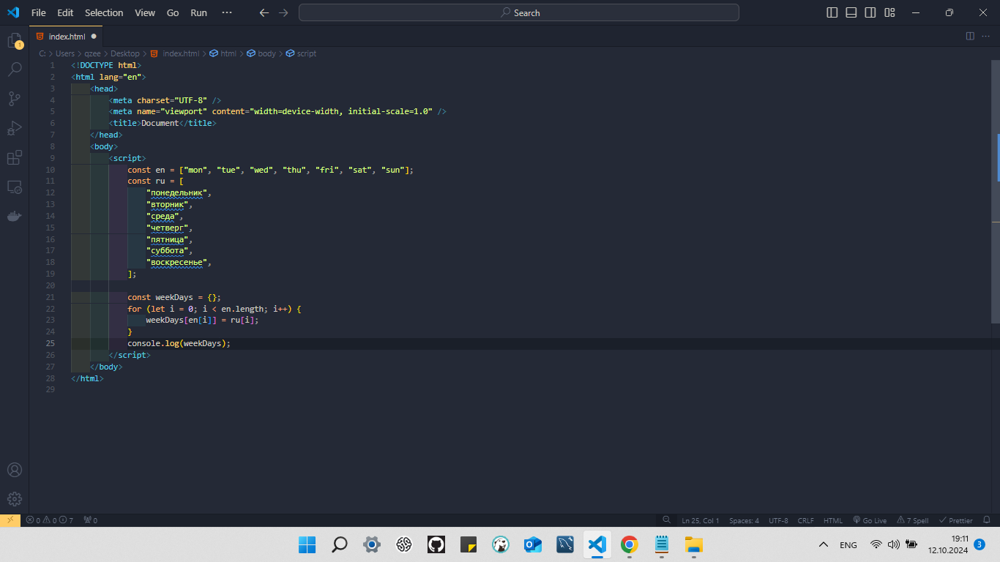
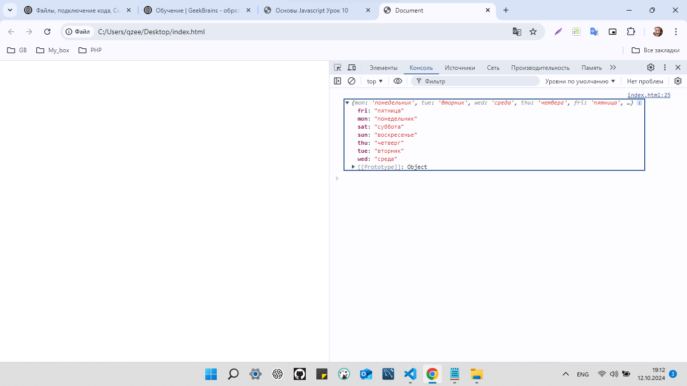

Промежуточная аттестация.
```
Выполнил студент GB Зуев М.М. группа №6014
```
## Задание 1
>Описание задачи: Дан объект numbers. Необходимо вывести в консоль все значения, которые больше или равны 3.




## Задание 2
>Описание задачи: Из объекта post, который задан в константе, выведите значения с комментариями в консоль.



## Задание 3
>Описание задачи: Дан массив products. Уменьшите цену каждого продукта на 15% с использованием метода forEach.



## Задание 4
>Описание задачи: 1. Выведите в консоль массив продуктов, у которых есть хотя бы одна фотография, используя метод filter. 2. Отсортируйте массив products по цене в порядке возрастания и выведите отсортированный массив в консоль.



> Задание 5 Необязательное задание Описание задачи: Есть два массива en и ru. Объедините их в объект, где значения из первого массива будут ключами, а значения из второго массива — значениями. `const en = ["mon", "tue", "wed", "thu", "fri", "sat", "sun"]; const ru = ["понедельник", "вторник", "среда", "четверг", "пятница", "суббота", "воскресенье"];`

