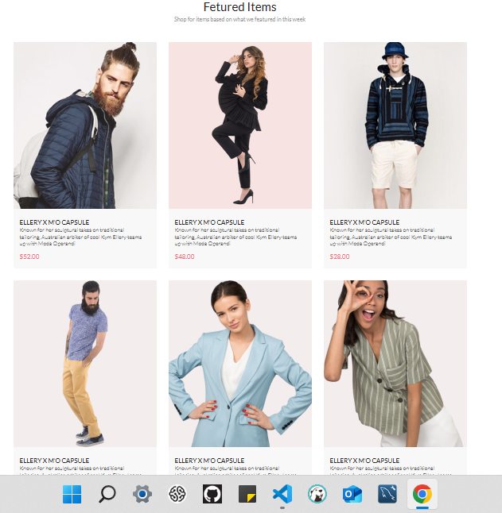

# Продолжение JavaScript
## Урок 11. Семинар. Шаблонизация
```
Домашнее задание.
Выполнил студент GB Зуев Максим Михайлович, группа № 6014.
```
Задание.

> Дан макет сайта https://www.figma.com/file/mnLY69cYE5cqWM5w6n5hXx/Seo-%26-Digital-Marketing-Landing-Page?node-id=190%3A1194&t=q4NMnXTnwyyTSGA6-0 
> В блоке Featured Items небходимо реализовать шаблон товаров.

> Для этого необходимо создать json формат данных по всем товарам. 

> Из этого файла сформировать блок Featured Items. `Всю вёрстку остальных частей реализовывать не нужно, если у вас она была сделана на html/css можно использовать, заново создавать не требуется`.
---
[HTML Code](./index.html) Основная страница
---
[CSS Code](./style.css) Стили
---
[JS Code](./script.js) Шаблон
---
[JSON Code](./data.js) Данные
---
## Пример "Решение задачи" размещение на сервере.
http://sxcary2r.beget.tech/
---

