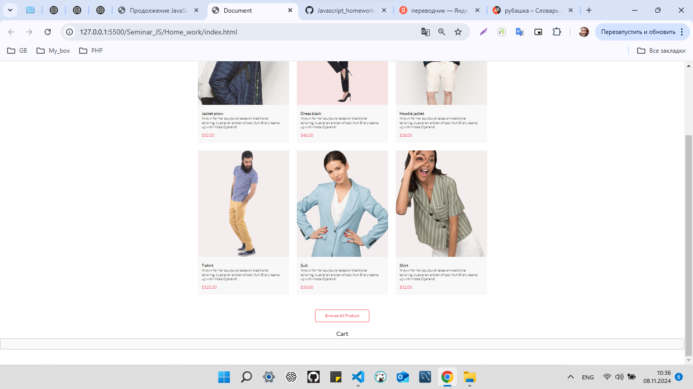
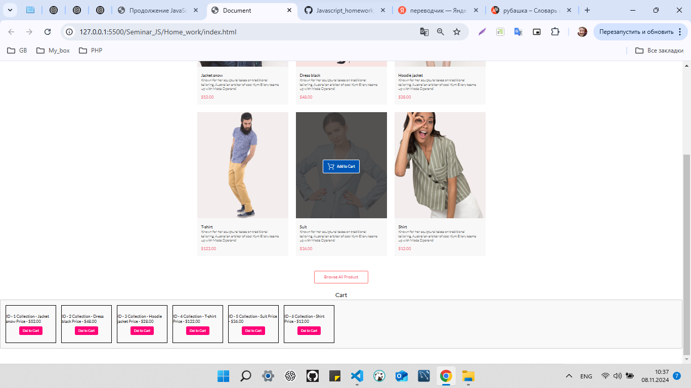
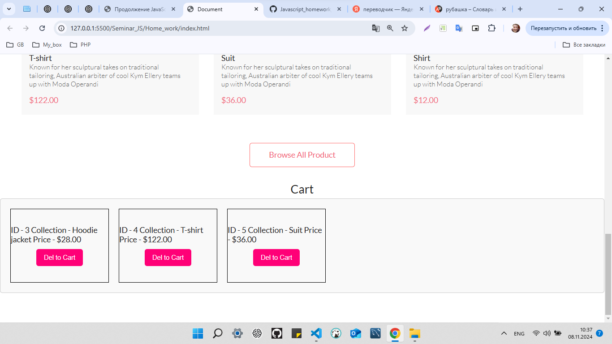

# Продолжение JavaScript
## Урок 13. Семинар. Работа с медиа
```
Домашнее задание.
Выполнил студент GB Зуев Максим Михайлович, группа № 6014.
```
Задание.
> [Файл с заданием](./Home_work/screen/Методичка%203.%20Работа%20с%20DOM.pdf) для проверки преподавателем находится в материалах уроку.
---
[HTML Code](./Home_work/index.html) Основная страница
---
[CSS Code](./Home_work/style.css) Стили
---
[JS Code](./Home_work/script.js) Шаблон
---
[JSON Code](./Home_work/data.js) Данные
---




