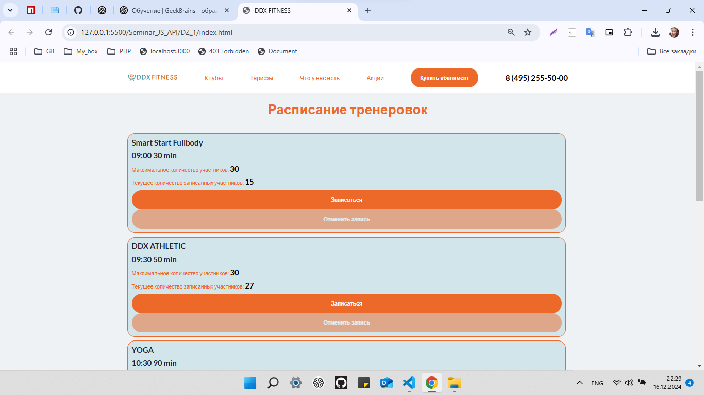
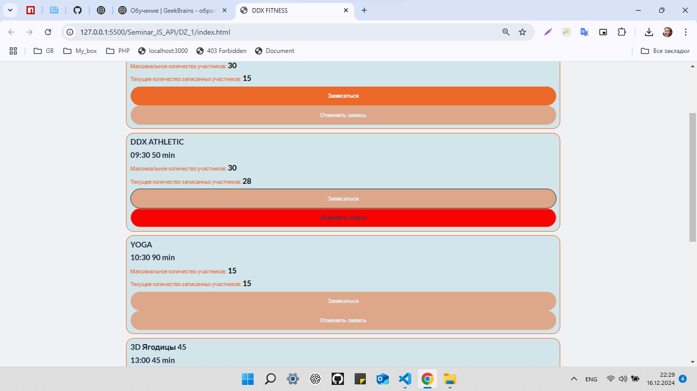

# JavaScript про API браузеров (семинары в записи)
## Урок 1. Dom-дерево
> Выполнил студент GB Зуев Максим Михайлович, группа № 6014.
---
 => [Файл с заданием](./dz-1.txt)  
 => [Файлы проекта](../DZ_1//)  
 ---

