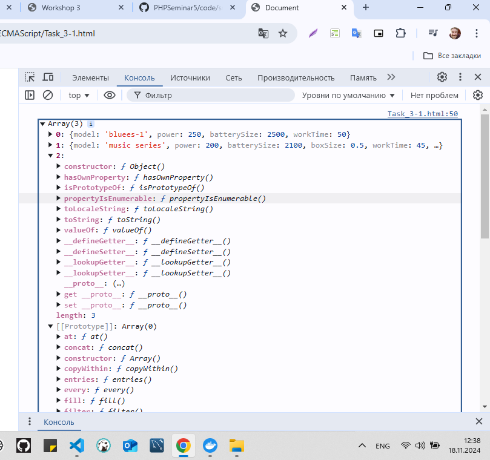
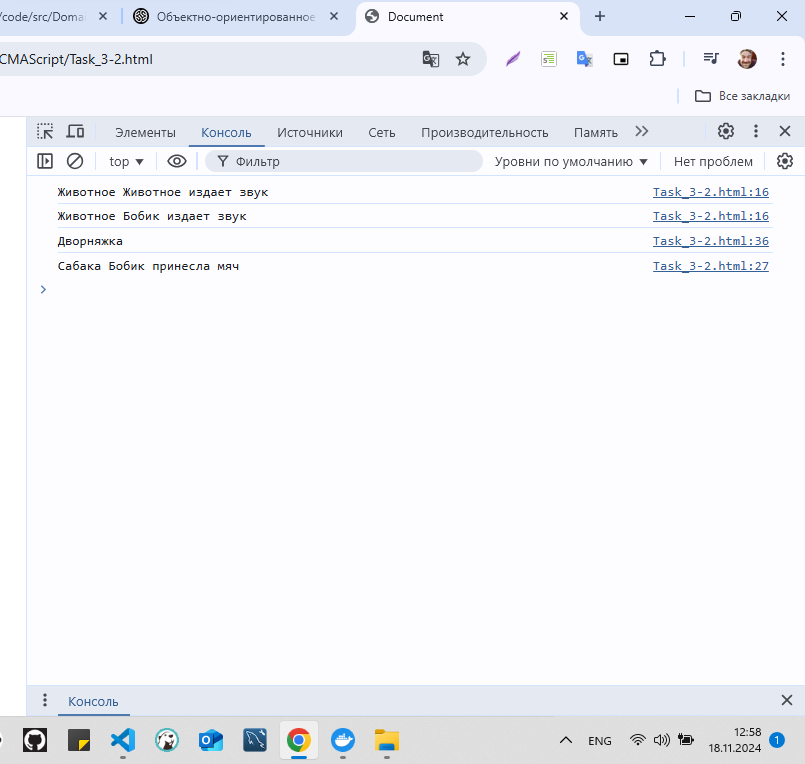
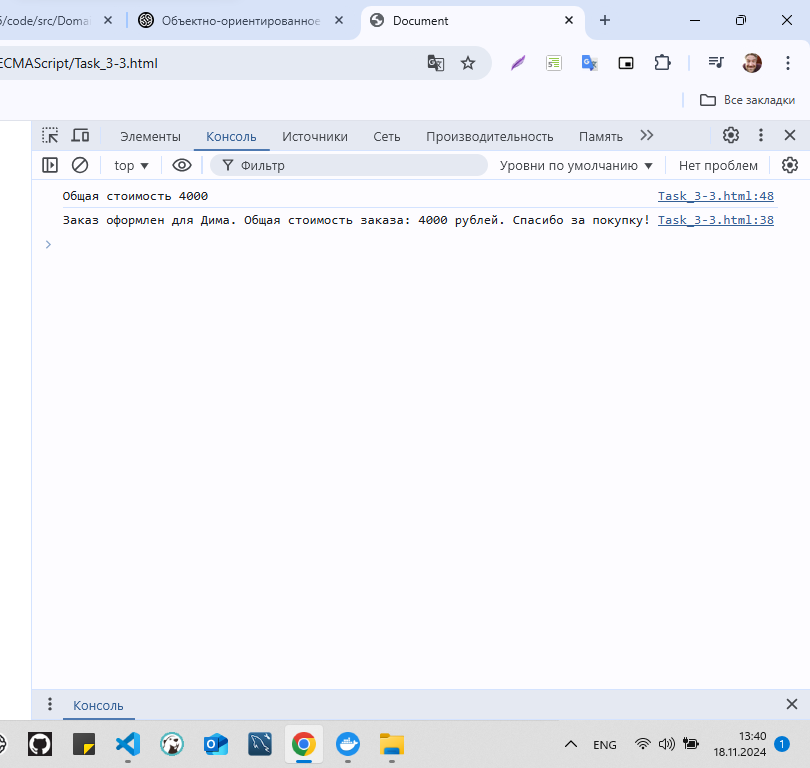
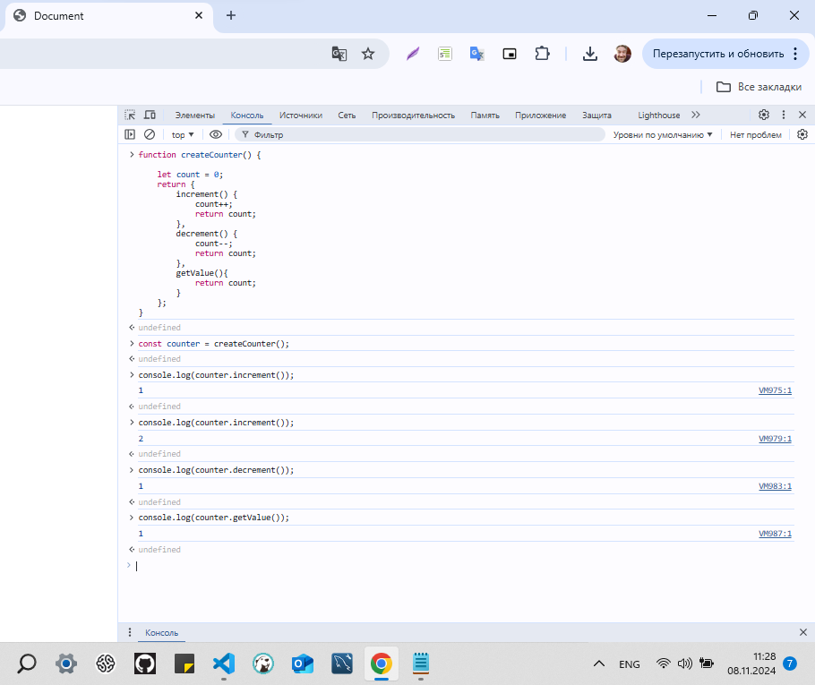

# JavaScript про ECMAScript (семинары)
## Урок 3. Объектно-ориентированное программирование в Javascript
```
Домашнее задание.
Выполнил студент GB Зуев Максим Михайлович, группа № 6014.
```
---
[`File_Task 1`](./Task_3-1.html)
[`File_Task 2`](./Task_3-2.html)
[`File_Task 3`](./Task_3-3.html)
***



---


# Урок 2. Основы ООП (объектно-ориентированного программирования)
[`File_Task 1`](./Task_2-1.html)
[`File_Task 2`](./Task_2-2.html)
[`File_Task 3`](./Task_2-3.html)
[`File_Task 4`](./Task_2-4.html)
[`File_Task 5`](./Task_2-5.html)
***
[`Task_pdf`](./screen_shots/Task_2.pdf) <=
---


# Урок 1. Функциональный JavaScript
[`Code`](./HW_1.txt) <=
---
[`Task_pdf`](./screen_shots/Task.pdf) <=
---



---