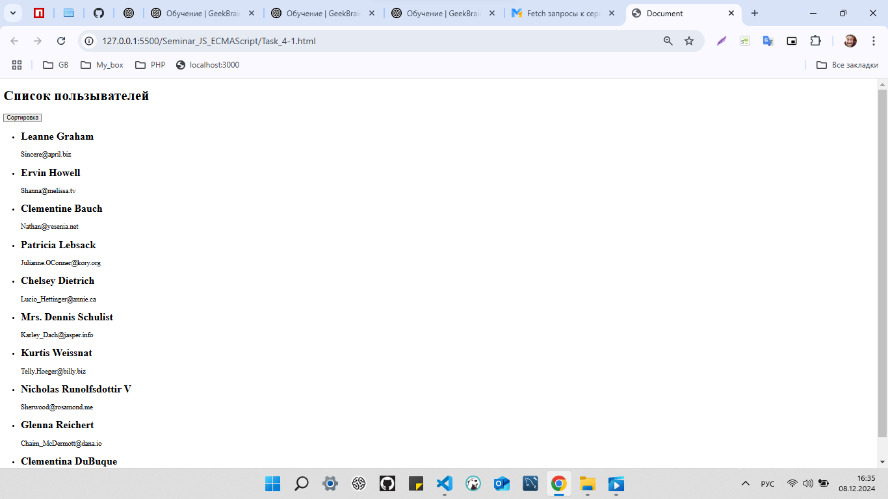
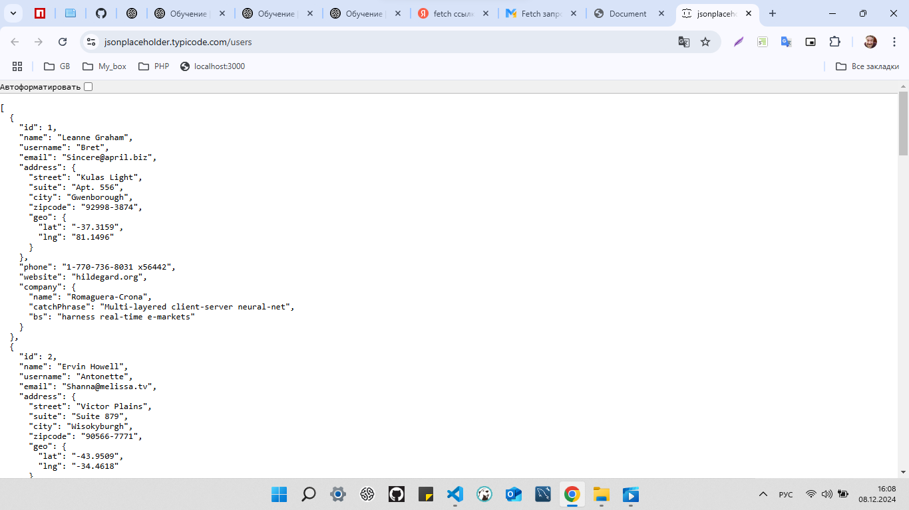
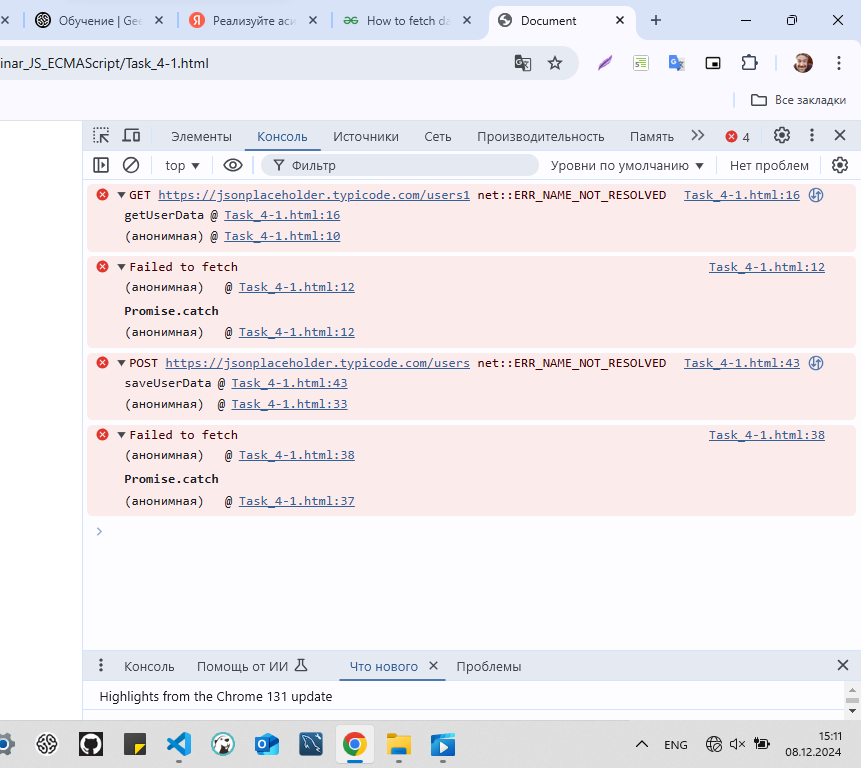
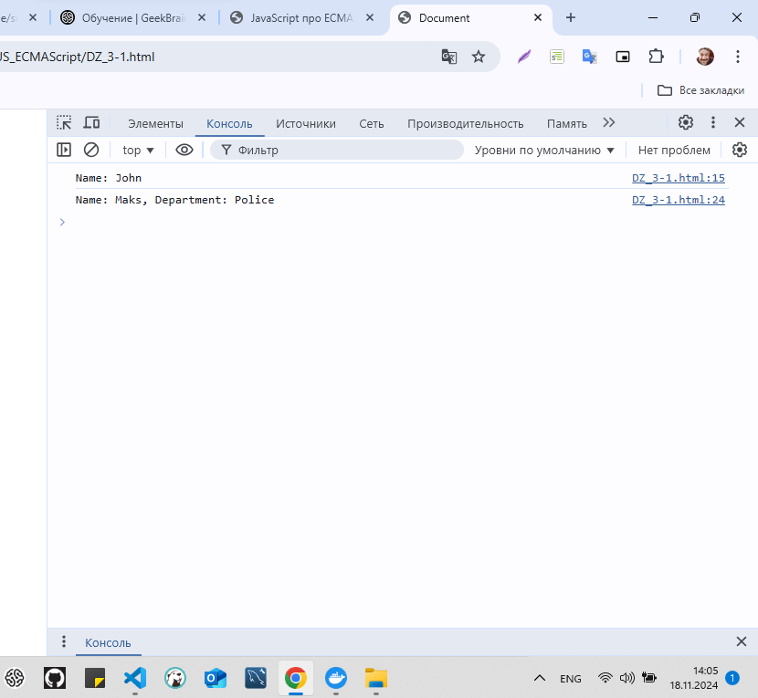
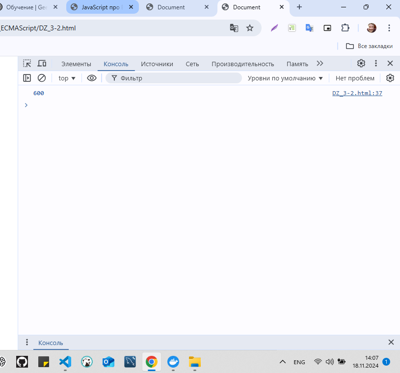

# JavaScript про ECMAScript (семинары)
```
Домашнее задание.
Выполнил студент GB Зуев Максим Михайлович, группа № 6014.
```
## Урок 4. Асинхронность в Javascript
[`Практическая работа 1`](./screen_shots/Task_4.pdf)
[`File_Task 1`](./Task_4-1.html)
[`File_Task 2`](./Task_4-2.html)



```
Представленное домашнее задание - с оценкой преподавателя.

Задание важно выполнить, чтобы проверить как вы овладели новыми знаниями, для успеваемости, эффективности обучения и достижения новых результатов.
```
---
## Урок 3. Объектно-ориентированное программирование в Javascript
---
[`File_Task 1`](./Task_3-1.html)
[`File_Task 2`](./Task_3-2.html)
[`File_Task 3`](./Task_3-3.html)
[`DZ-1`](./DZ_3-1.html)
[`DZ-2`](./DZ_3-2.html)
***




---


# Урок 2. Основы ООП (объектно-ориентированного программирования)
[`File_Task 1`](./Task_2-1.html)
[`File_Task 2`](./Task_2-2.html)
[`File_Task 3`](./Task_2-3.html)
[`File_Task 4`](./Task_2-4.html)
[`File_Task 5`](./Task_2-5.html)
***
[`Task_pdf`](./screen_shots/Task_2.pdf) <=
---


# Урок 1. Функциональный JavaScript
[`Code`](./HW_1.txt) <=
---
[`Task_pdf`](./screen_shots/Task.pdf) <=
---


---