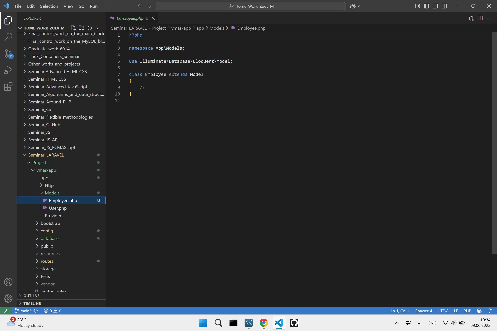

# Продвинутое программирование на PHP — Laravel
> Домашнее задание. Выполнил студент GB Зуев Максим Михайлович, группа № 6014.  

***
### Содержание 
[Задание 1 ](#урок-1-введение-установка-и-первичная-настройка)  
[Задание 2](#урок-2-контроллеры-экшены-и-роутинг)  
[Задание 3](#урок-3-работа-с-базами-данных-orm-система-eloquent)  
[Задание 4](#урок-4-работа-с-шаблонами-шаблонизатор-blade)  
[Задание 5](#урок-5-обработка-запроса-request)  
[Задание 6](#урок-6-работа-с-формами)  
[Задание 7](#урок-7-формирование-ответа-response)  
[Задание 8](#урок-8-сервисы-создание-и-использование)  
[Задание 9](#урок-9-работа-с-событиями)  
[Задание 10](#урок-10-встроенные-возможности-laravel)  
[Задание 11](#урок-11-реализация-авторизации)
***

## Урок 11. Реализация авторизации

|File|Explorer / Link|
|:-|:-|
|Задание|[Task_11.txt](./Task/Taks_11.txt)|
|Файлы проекта|[HomeWork](./Project/vmas-app/)|
|Мурзилка|[Murzilka](./Link_to_PHP_Laravel.txt)|  

***

***

## Урок 10. Встроенные возможности Laravel

|File|Explorer / Link|
|:-|:-|
|Задание|[Task_10.txt](./Task/Taks_10.txt)|
|Файлы проекта|[HomeWork](./Project/vmas-app/)|
|Мурзилка|[Murzilka](./Link_to_PHP_Laravel.txt)|  

***

***

## Урок 9. Работа с событиями

|File|Explorer / Link|
|:-|:-|
|Задание|[Task_9.txt](./Task/Taks_9.txt)|
|Файлы проекта|[HomeWork](./Project/vmas-app/)|
|Мурзилка|[Murzilka](./Link_to_PHP_Laravel.txt)|  

***

***

## Урок 8. Сервисы: создание и использование

|File|Explorer / Link|
|:-|:-|
|Задание|[Task_8.txt](./Task/Taks_8.txt)|
|Файлы проекта|[HomeWork](./Project/vmas-app/)|
|Мурзилка|[Murzilka](./Link_to_PHP_Laravel.txt)|  

***

***

## Урок 7. Формирование ответа (Response)

|File|Explorer / Link|
|:-|:-|
|Задание|[Task_7.txt](./Task/Taks_7.txt)|
|Файлы проекта|[HomeWork](./Project/vmas-app/)|
|Мурзилка|[Murzilka](./Link_to_PHP_Laravel.txt)|  

***

***
## Урок 6. Работа с формами

|File|Explorer / Link|
|:-|:-|
|Задание|[Task_6.txt](./Task/Taks_6.txt)|
|Файлы проекта|[HomeWork](./Project/vmas-app/)|
|Мурзилка|[Murzilka](./Link_to_PHP_Laravel.txt)|  

***

***

## Урок 5. Обработка запроса (Request)

|File|Explorer / Link|
|:-|:-|
|Задание|[Task_5.txt](./Task/Taks_5.txt)|
|Файлы проекта|[HomeWork](./Project/vmas-app/)|
|Мурзилка|[Murzilka](./Link_to_PHP_Laravel.txt)|  

***

***

## Урок 4. Работа с шаблонами. Шаблонизатор Blade

|File|Explorer / Link|
|:-|:-|
|Задание|[Task_4.txt](./Task/Taks_4.txt)|
|Файлы проекта|[HomeWork](./Project/vmas-app/)|
|Мурзилка|[Murzilka](./Link_to_PHP_Laravel.txt)|  

***

***

## Урок 3. Работа с базами данных. ORM-система Eloquent

|File|Explorer / Link|
|:-|:-|
|Задание|[Task_3.txt](./Task/Taks_3.txt)|
|Файлы проекта|[HomeWork](./Project/vmas-app/)|
|Мурзилка|[Murzilka](./Link_to_PHP_Laravel.txt)|  

***

***

## Урок 2. Контроллеры, экшены и роутинг.

|File|Explorer / Link|
|:-|:-|
|Задание|[Task_2.txt](./Task/Taks_2.txt)|
|Файлы проекта|[HomeWork](./Project/vmas-app/)|
|Мурзилка|[Murzilka](./Link_to_PHP_Laravel.txt)|  

***

***

## Урок 1. Введение, установка и первичная настройка

|File|Explorer / Link|
|:-|:-|
|Задание|[Task_1.txt](./Task/Taks_1.txt)|
|Файлы проекта|[HomeWork](./Project/vmas-app/)|
|Мурзилка|[Murzilka](./Link_to_PHP_Laravel.txt)|  

***

***