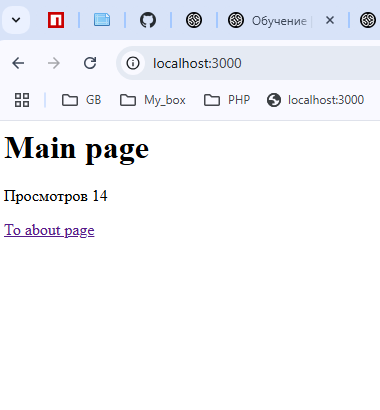
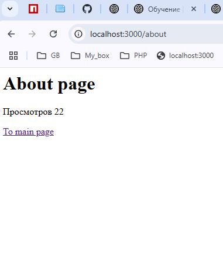
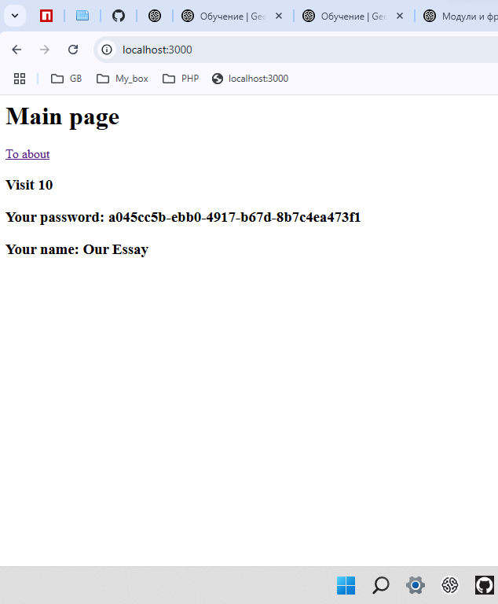
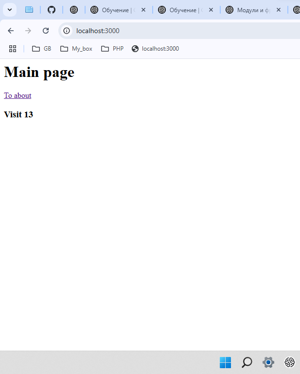

# Основы Node.js (семинары)

> Домашнее задание. Выполнил студент GB Зуев Максим Михайлович, группа № 6014.
```
Урок 3. Модули и фреймворк Express (WIP)
Напишите HTTP сервер на express и реализуйте два обработчика “/” и “/about”, где:

— На каждой странице реализован счетчик просмотров
— Значение счетчика необходимо сохранять в файл каждый раз, когда обновляется страница
— Также значение счетчика должно загружаться из файла, когда запускается обработчик страницы
— Таким образом счетчик не должен обнуляться каждый раз, когда перезапускается сервер.

Подсказка:
Вы можете сохранять файл в формате JOSN,
где в объекте ключом будет являться URL страницы, а значением количество просмотров страницы

Формат сдачи работы:
— Ссылка на гитхаб/гитлаб
— Файл с кодом.
```

File => [Project](./DZ_Project/)
File => [ticPages.json](./DZ_Project/ticPages.json)
---

> Постарался сделать проект так чтобы сначала была проверка файла с массивом, и если его нет создавался и далее по проекту только вносились изменения в данный файл.
---


***
```
Урок 2. Введение в NPM
Написать свою собственную библиотеку и опубликовать в NPM.

Что нужно помнить при реализации:

— Ваш модуль должен обязательно экспортировать функции которые будут полезны вашим пользователям с помощью modules.exports
— Не забудьте указать в package.json в поле main файл, который будет основным в вашей библиотеке
— Обязательно создайте и опишите README.md файл в корне вашего проекта
— Если у вас есть репозиторий в github или gitlab, опубликуйте туда ваш код и в package.json укажите ссылку на репозиторий в поле repository
— Протестируйте работу вашей библиотеки после публикации. Попробуйте установить её в любом другом проекте с помощью npm i имявашейбиблиотеки и попробуйте ее использовать.

Формат сдачи задания:
— Достаточно прислать ссылку на сайт https://npmjs.com/ на вашу библиотеку.

Идеи для библиотеки:

— Библиотека для генерации случайных данных, таких как имена, адреса, даты, числа и т.д. Это может быть полезно для тестирования или создания заглушек данных.
— Библиотека для работы с математикой: например функции для решения квадратных уравнений.
— Библиотека для генерации паролей, которая позволяет генерировать случайные и безопасные пароли. Можно реализовать методы для указания длины пароля, использования различных типов символов (буквы, цифры, специальные символы) и т.д.
```
---
File => [Project](./DZ_Project/)
File => [Code](./DZ_Project/arrived/code.md)
---

***


```
Урок 1. Введение в Node.js
Напишите HTTP сервер и реализуйте два обработчика, где:
— По URL “/” будет возвращаться страница, на которой есть гиперссылка на вторую страницу по ссылке “/about”
— А по URL “/about” будет возвращаться страница, на которой есть гиперссылка на первую страницу “/”
— Также реализуйте обработку несуществующих роутов (404).
— * На каждой странице реализуйте счетчик просмотров. Значение счетчика должно увеличиваться на единицу каждый раз, когда загружается страница.
```
File => [index.js](./DZ_Project/index.js)
---

