# Основы PHP (семинары в записи).
```
Домашнее задание.

Выполнил студент GB Зуев Максим Михайлович, группа № 6014.
```
---
> Задание 1. Собрать для себя окружение из Nginx + 
PHP-FPM и PHP CLI

- Скачиваем и устанавливаем Docker Desktop.
- Идем по пути `С:\windows\system32\drivers\ect\` и редактируем файл `hosts` требуется добавить в конец файла `127.0.0.1 mysite.local`
- Создаем папку для проекта gp_php на рабочем столе.
- В IDE VS Code открываем ранее созданную папку и создаем файл `index.php`.
- В терминале выполняем команду `docker run --rm -v ${pwd}/php-cli/:/cli php:8.2-cli php /cli/index.php`.
- В файле `index.php` напишем `echo "Hello world"` и выполним выше указанную команду .
- Далее из [ArhiveFile](./ArhiveFile/fpm.zip) установим дополнительные папки.
- Воспользуемся командой `docker-compose up`.
---
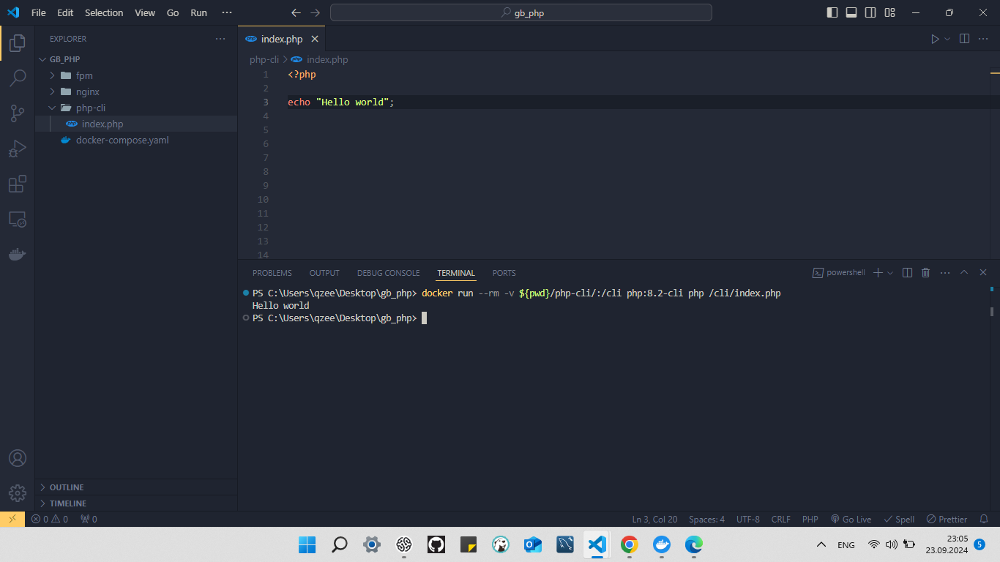
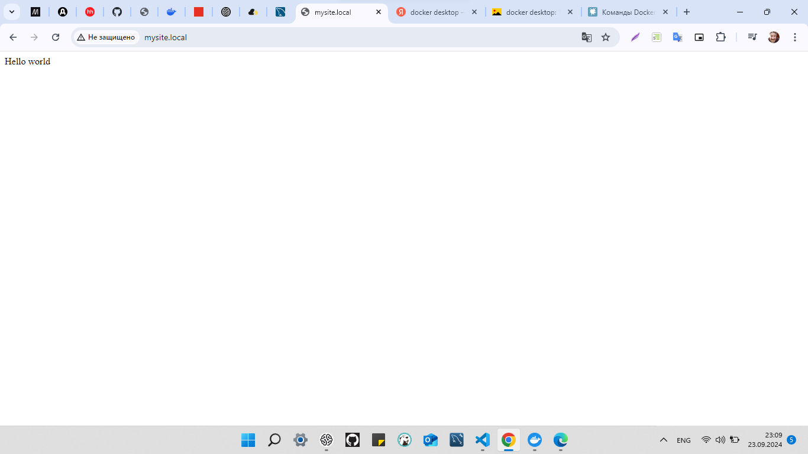
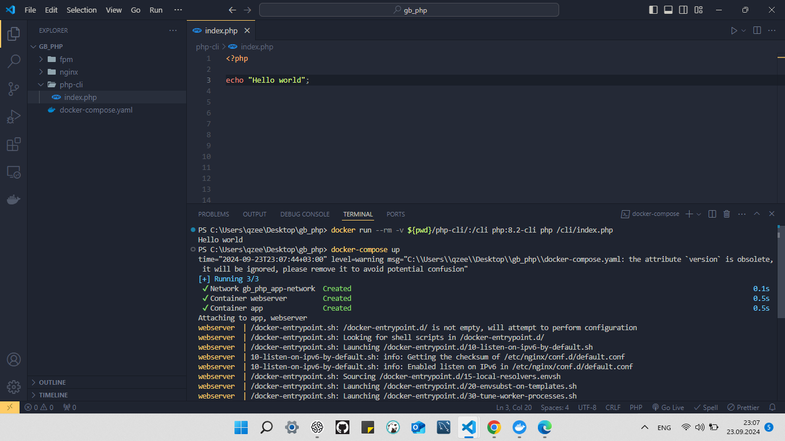
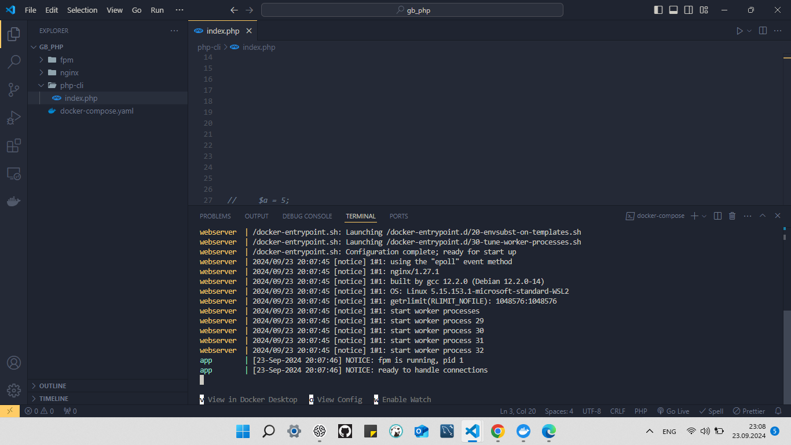
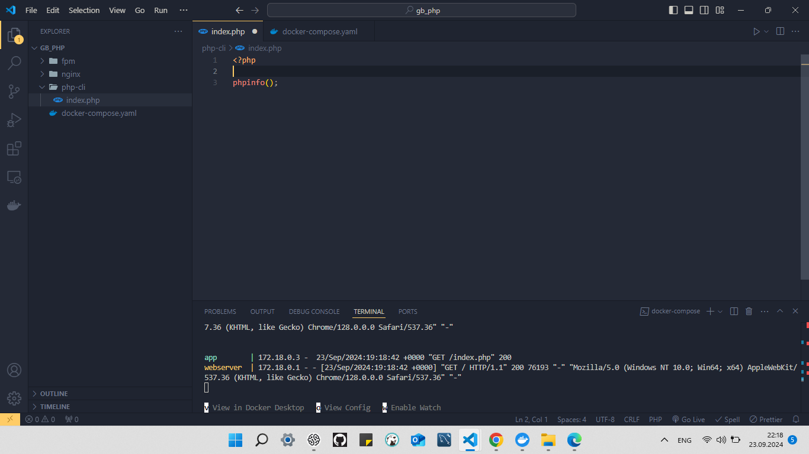
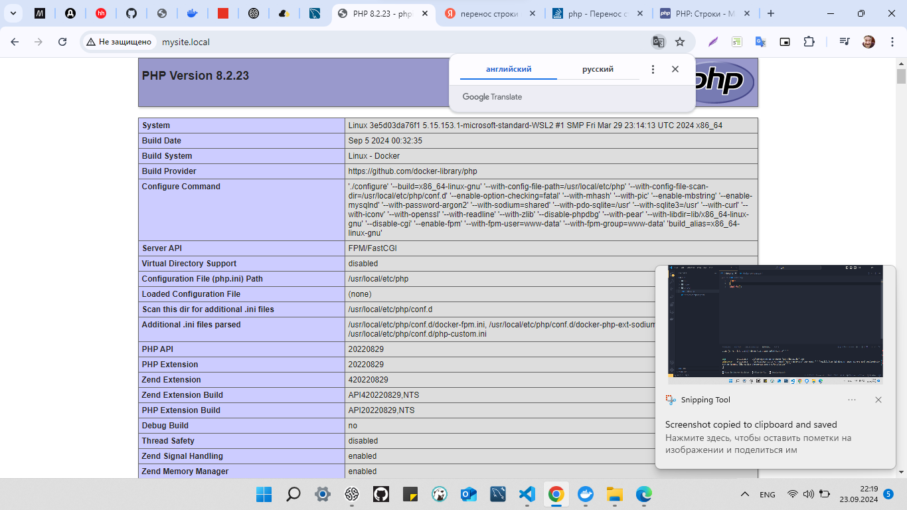
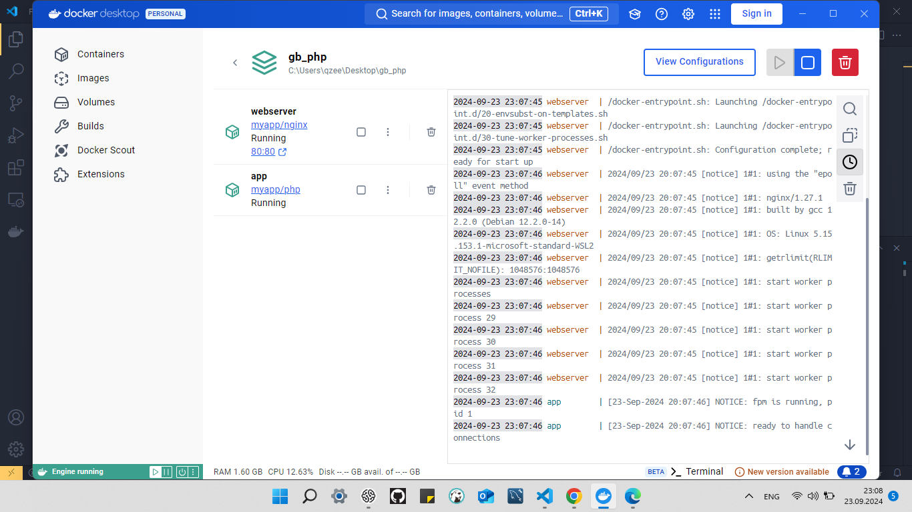
---
> Задание 2. Выполните код в контейнере PHP CLI и объясните, что выведет данный код и почему:
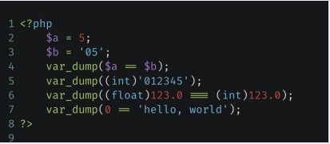
---

>Команда `echo` не всегда дает представление о том, что мы выводим. Для отладки программ лучше использовать специальную функцию `var_dump`. Она помимо вывода строки или числа еще будет указывать тип выводимых данных, а также их размер:
---
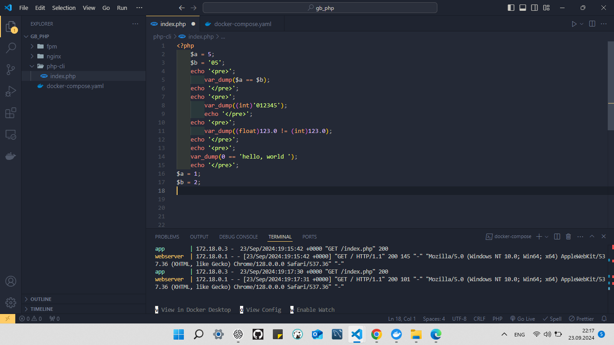
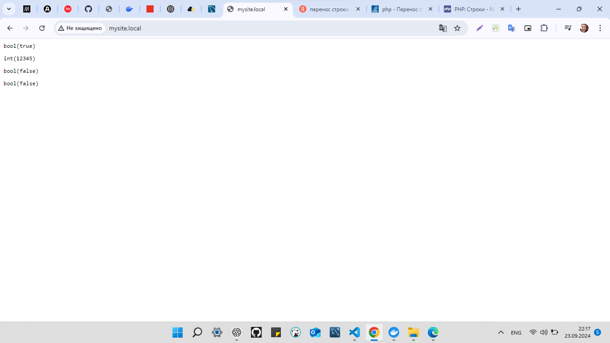
---
> Задание 3. В контейнере с PHP CLI поменяйте версию PHP с 8.2 на 7.4.

> В файле `Dockerfile` внести изменения версии PHP : `FROM php:7.4-fpm`
сохранить и перезапустить контейнер.

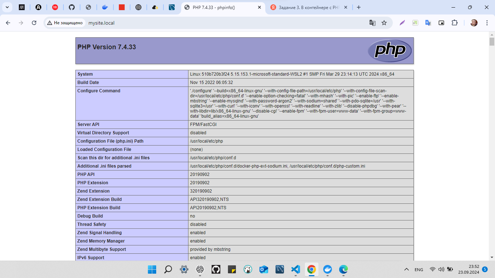

> Задание 4. Используя только две числовые переменные, поменяйте их значение местами. Например, если `a = 1, b = 2,` надо, чтобы получилось: `b = 1, a = 2`. Дополнительные переменные, функции и конструкции типа `list()` использовать нельзя.

```php
$a = 1;
$b = 2;
echo "A = $a <br/>";
echo "B = $b <br/>";
$a = $a + 1;
echo "A = $a <br/>";
$b = $a - 1;
echo "B = $b <br/>";
```
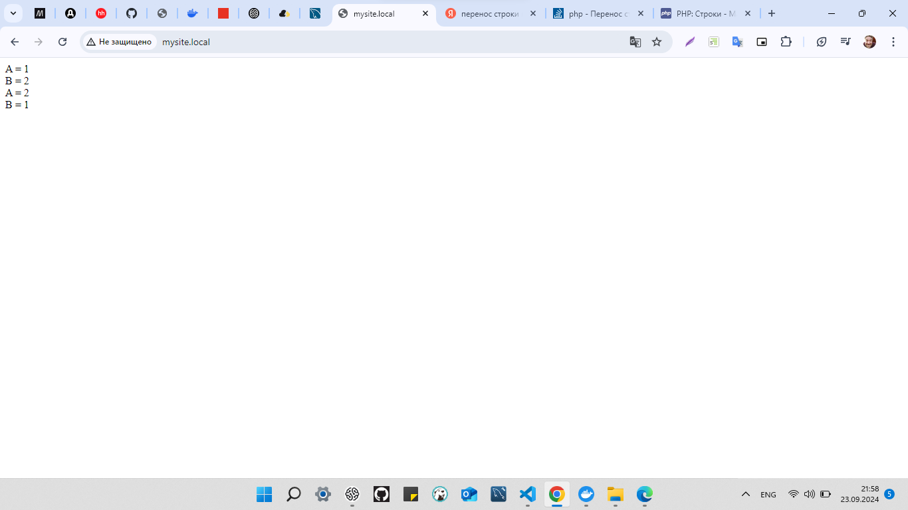

