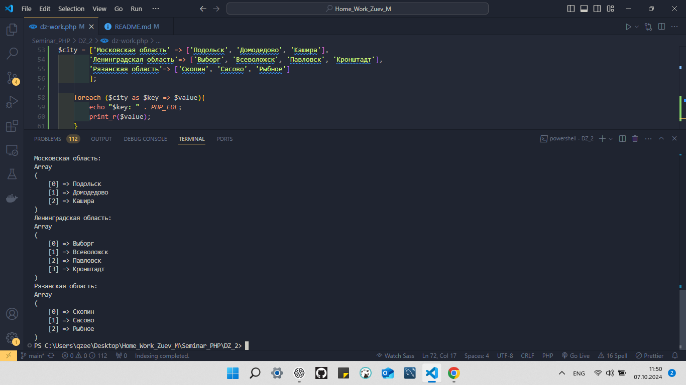
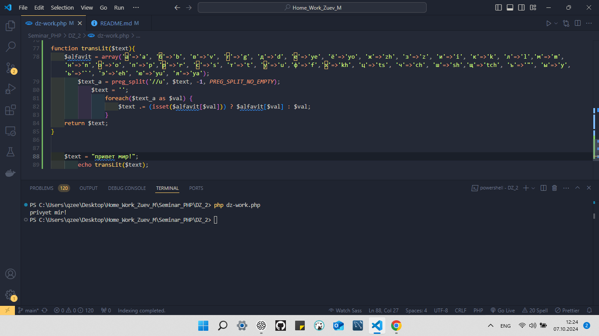
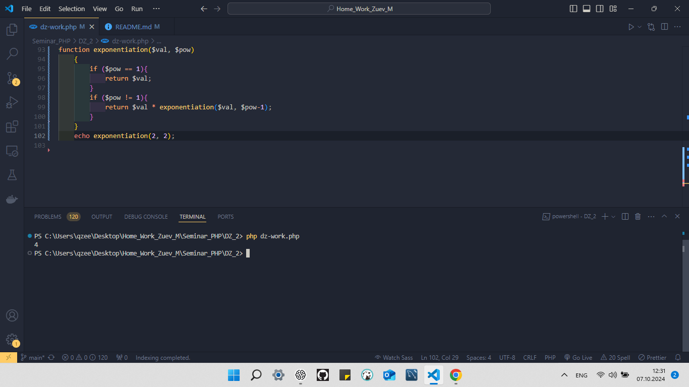

# Основы PHP (семинары в записи).
###### Урок 2. Условия, Массивы, циклы, функции
```
Домашнее задание.
Выполнил студент GB Зуев Максим Михайлович, группа № 6014.
```

> 1. Реализовать основные 4 арифметические операции в виде функции с тремя параметрами – два параметра это числа, третий – операция. Обязательно использовать оператор `return`. 
---
> 2. Реализовать функцию с тремя параметрами: function mathOperation`($arg1, $arg2, $operation)`, где `$arg1, $arg2` – значения аргументов, `$operation` – строка с названием операции. В зависимости от переданного значения операции выполнить одну из арифметических операций (использовать функции из пункта 3) и вернуть полученное значение (использовать `switch`). .
---
> 3. Объявить массив, в котором в качестве ключей будут использоваться названия областей, а в качестве значений – массивы с названиями городов из соответствующей области. Вывести в цикле значения массива, чтобы результат был таким:`Московская область: Москва, Зеленоград, Клин`,`Ленинградская область: Санкт-Петербург, Всеволожск, Павловск, Кронштадт`,Рязанская область … (названия городов можно найти на `maps.yandex.ru`).
 
---
> 4. Объявить массив, индексами которого являются буквы русского языка, а значениями – соответствующие латинские буквосочетания (‘а’=> ’a’, ‘б’ => ‘b’, ‘в’ => ‘v’, ‘г’ => ‘g’, …, ‘э’ => ‘e’, ‘ю’ => ‘yu’, ‘я’ => ‘ya’). Написать функцию транслитерации строк..
---
> 5. *С помощью рекурсии организовать функцию возведения числа в степень. Формат: `function power($val, $pow)`, где `$val` – заданное число, `$pow` – степень.

>6. *Написать функцию, которая вычисляет текущее время и возвращает его в формате с правильными склонениями, например: `22 часа 15 минут 21 час 43 минуты`.