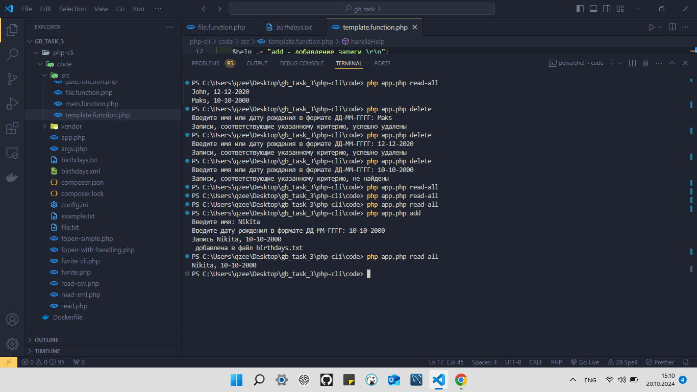

# Основы PHP (семинары в записи)
## Урок 3. Файлы, подключение кода, Composer
```
Домашнее задание.
Выполнил студент GB Зуев Максим Михайлович, группа № 6014.
```
> 1. Обработка ошибок. Посмотрите на реализацию функции в файле fwrite-cli.php в исходниках. Может ли пользователь ввести некорректную информацию (например, дату в виде 12-50-1548)? Какие еще некорректные данные могут быть введены? Исправьте это, добавив соответствующие обработки ошибок.


---
> 2. Поиск по файлу. Когда мы научились сохранять в файле данные, нам может быть интересно не только чтение, но и поиск по нему. Например, нам надо проверить, кого нужно поздравить сегодня с днем рождения среди пользователей, хранящихся в формате: `Василий Васильев, 05-06-1992` И здесь нам на помощь снова приходят циклы. Понадобится цикл, который будет построчно читать файл и искать совпадения в дате. Для обработки строки пригодится функция explode, а для получения текущей даты – date.


---
> 3. Удаление строки. Когда мы научились искать, надо научиться удалять конкретную строку. Запросите у пользователя имя или дату для удаляемой строки. После ввода либо удалите строку, оповестив пользователя, либо сообщите о том, что строка не найдена.


---
> 4. Добавьте новые функции в итоговое приложение работы с файловым хранилищем.

