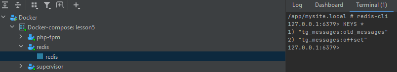

### DockerRun

```sh
# Сборка проекта
sh build.sh lesson5 && exit
```
```sh
# Запуск проекта (тестовый, при выходе остановит)
sh start.sh lesson5 php-fpm && exit
```

###### Перед запуском:
- Переименовать `docker/.env.example` в `docker/.env`
- Установить свой часовой пояс `TIMEZONE` в `docker/.env`
- Переименовать `app/.env.example` в `app/.env`
- Вставить токен своего бота `TELEGRAM_TOKEN` в `app/.env`
- Создать БД `app/database/database.sqlite`
  ```db
  table `event`
  - (int, ai)   `id`
  - (string)    `name`
  - (string)    `text`
  - (string)    `receiver_id`
  - (string)    `minute`
  - (string)    `hour`
  - (string)    `day`
  - (string)    `month`
  - (string)    `day_of_week`
  ```

### Commands:
```txt
# Добавление сообщения
php runner -c save_event --name 'Test' --receiver <tg_user_id> --text 'Text message' --cron '* * * * *'

# Отправка сообщений вручную
php runner -c handle_events

# Тесты
php runner -c test
vendor/bin/phpunit --coverage-text -c phpunit.xml

# Other
php runner -c tg_messages
```

### UPD
