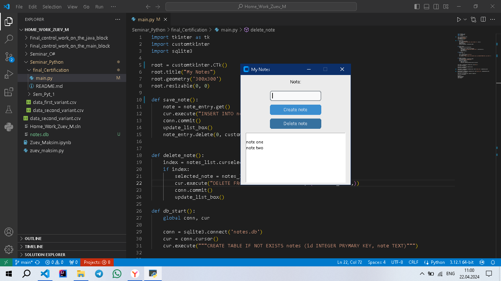
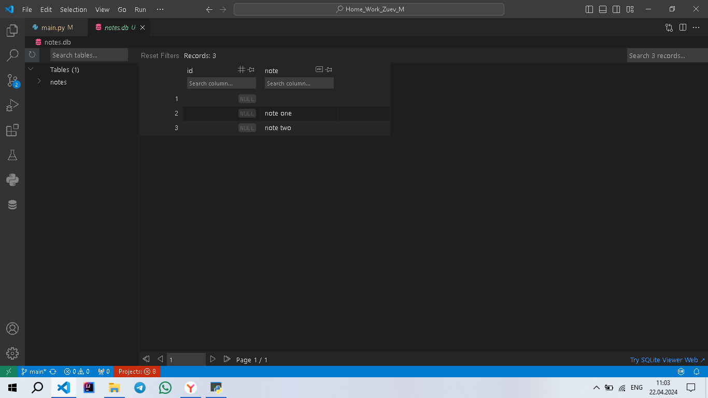

## Привет дорогой друг, это визуальное приложение "Notes" для создания заметок.

```
Приложение построено на базе Tkinter, Customtkinter и sqlite3 
```
Почему имеено так: 

* Tkinter и Customtkinter приятнее глазу, чем терминальное приложение, все таки 21 век.

* Sqlite3 база данных более гибкая, чем списки. Хотя немного сложнее в работе.



