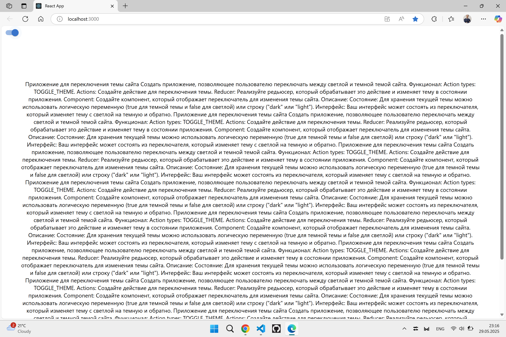
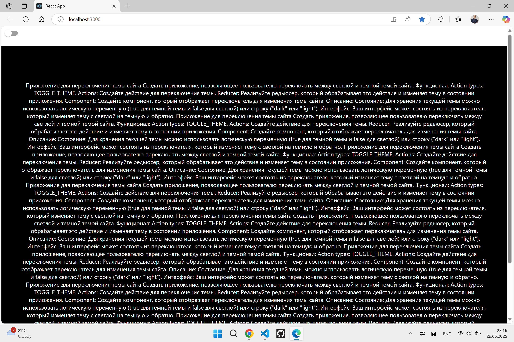
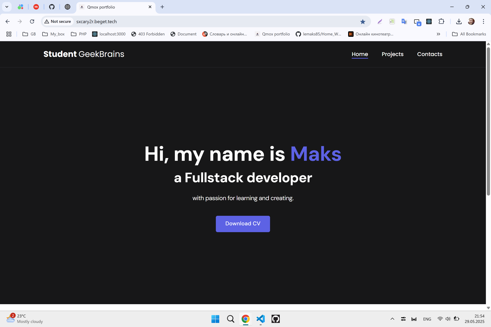
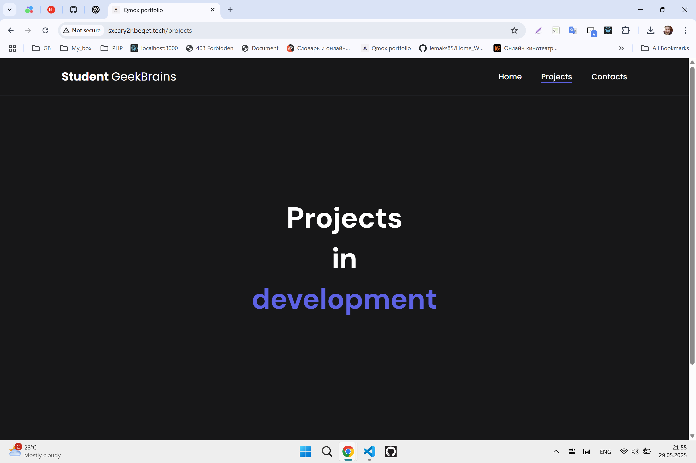
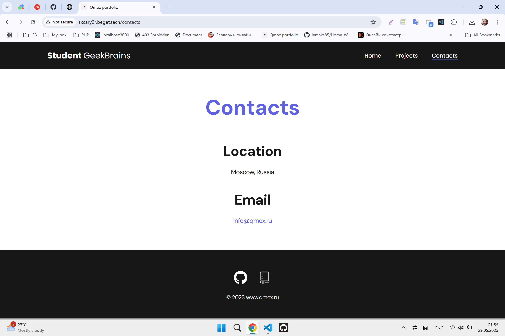
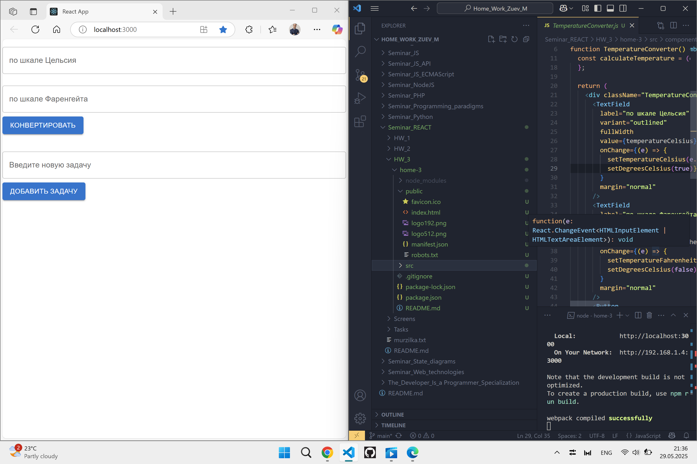

# Фреймворк React JS (семинары в записи)

> Домашнее задание. Выполнил студент GB Зуев Максим Михайлович, группа № 6014.
```
Урок 5. Компоненты высшего порядка знакомство с Redux
```
Задание => [Task_5.txt](./Tasks/task_5.txt)  
Файлы проекта => [HW_5](./HW_5/)    
Мурзилка => [Murzilka](./murzilka.txt)  



---
```
Урок 4. Children. Роутинг в React
```
Ссылка на сайт => http://sxcary2r.beget.tech/  
Задание => [Task_4.txt](./Tasks/task_4.txt)  
Файлы проекта => [HW_4](./HW_4/)    
Мурзилка => [Murzilka](./murzilka.txt)  




---
```
Урок 3. Virtual DOM. Подключение библиотеки UI-компонентов
```
Задание => [Task_3.txt](./Tasks/task_3.txt)  
Файлы проекта => [HW_3](./HW_3/)    
Мурзилка => [Murzilka](./murzilka.txt)  


---
```
Урок 2. State, Props. Жизненный цикл react компонента. Хуки
```
Задание => [Task_2.txt](./Tasks/task_2.txt)  
Файлы проекта => [HW_2](./Project/gbzuevmm/)    
Файл json => [text.json](./Project/gbzuevmm/src/components/text.json)  
Мурзилка => [Murzilka](./murzilka.txt)  


---
```
## Урок 1. Знакомство с React и первые компоненты. Работа с JSX
```
Задание => [Task_1.txt](./Tasks/task_1.txt)  
Файлы проекта => [HW_1](./HW_1/Project/gbzuevmm/)    
Мурзилка => [Murzilka](./murzilka.txt)  


