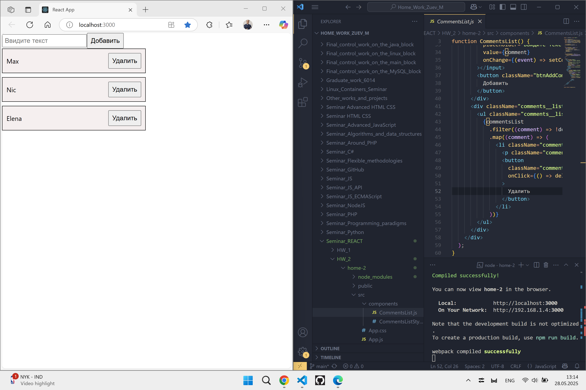

# Фреймворк React JS (семинары в записи)

> Домашнее задание. Выполнил студент GB Зуев Максим Михайлович, группа № 6014.
```
Урок 2. State, Props. Жизненный цикл react компонента. Хуки
```
Задание => [Task_1.txt](./Tasks/task_1.txt)  
Файлы проекта => [Project](./Project/gbzuevmm/)    
Файл json => [text.json](./Project/gbzuevmm/src/components/text.json)  
Мурзилка => [Murzilka](./murzilka.txt)  


---

```
## Урок 1. Знакомство с React и первые компоненты. Работа с JSX
```
Задание => [Task_2.txt](./Tasks/task_1.txt)  
Файлы проекта => [Project](./HW_2/home-2/)    
Мурзилка => [Murzilka](./murzilka.txt)  
---


