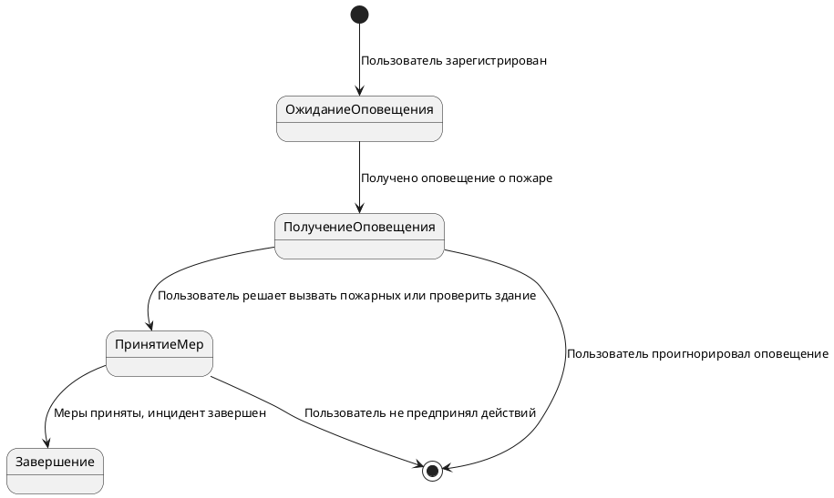

## Диаграммы состояний. Обучение в записи
```
Домашнее задание.

Выполнил студент GB Зуев Максим Михайлович, группа № 6014.
```
## Урок 2. Семинар. Основы диаграмм состояний
>Задание: Опишите диаграмму состояния оператора центра оповещения. Кейс прикреплен в материалах к семинару: ИТ решение для города Х.
---

==> [DZ-1](./DZ-1/Lesson-1.drawio.svg)
---

---

## Урок 4. Семинар. Конечные автоматы
>Задание: Постройте конечный автомат по работе с состояниями датчиков для города Х. Кейс прикреплен в материалах к семинару 1.

==> [DZ-2](./DZ-2/Lesson-2.drawio.svg)
---

---
| **Состояние** | **Событие** | **Действие** | **Следующее состояние** |
| --- | --- | --- | --- |
| Ожидание | Обнружен дым/температура | Отправить сигнал в центр управления | Обнаружение |
| Обнаружение | Сигнал отправлен | Ожидать подтверждения от центра | Ожидание подтверждения |
| Ожидание подтверждения | Подтверждение получено | Подтвердить наличие пожара, уведомить пользователей | Подтверждено |
| Ожидание подтверждения | Подтверждение не получено | Сигнал ложный, возврат к ожиданию | Ожидание |
| Подтверждено | Пожар устранен | Сброс состояния датчиков | Сброс |
| Сброс | - | Переключиться в режим ожидания | Ожидание |
---

## Урок 6. Семинар. Моделирование жизненного цикла объекта и введение в UML
>Задание: Постройте схему в PlantUML по работе с состояниями пользователей с системой обнаружения пожара. Кейс прикреплен в материалах к семинару 1.  ДЗ необходимо оформить в виде схемы и кода для создания схемы в `https://www.planttext.com/` и сдать в подписанном google docs с правами на редактирование.
---
==> [DZ-3](./DZ-3/)




>https://uml.planttext.com/plantuml/png/ZLDBRi903Dr7oXsyHkK2NLJSe-gY4kpQBWhTqrJy52IMtLJj5IBAmA1eu0hsZNZsy148XIoYn9utzdlFJglRUtxlVRo-fCbZuucQpGVYNrwovmKN7F1sYBUyuJaxcI12JcPqJ_o7P2bJNjbX8HaE4HCIXVGH_0FvAHc-FHu3SKYJDAdLmQZ47byoYkbRP0x03I6ymB4ZpMjs6Gc2IBtwaOhgu20p25NW3o3zAX-qXOoXqKb6F9SS23jNZquqWkGo89GisIE_TygPQrcqysYKChvAmnX-0sOtqVKW6VmC8NcilRyg-HtPzz3c0BHoN9qNi57LTqZtfsejeZIFjS20pfQYl3gkIh6tcWKTzzRMS74IhfrKxLht4XSyhzEarNbhumVO0G00