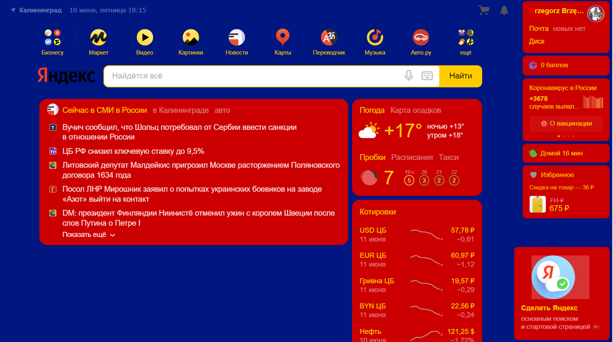
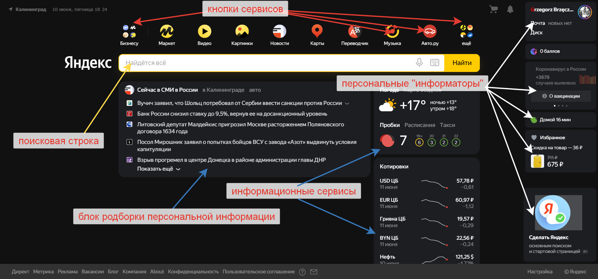

# Знакомство с веб-технологиями (семинары в записи)
```
Домашнее задание.

Выполнил студент GB Зуев Максим Михайлович, группа № 6014.
```
<details>
    <summary>Урок 1. Веб-технологии: вчера, сегодня, завтра</summary>
    <br> Задача: на основе сайта yandex.ru:
- Определите, на каком протоколе работает сайт.
- Проанализируйте структуру страницы сайта.
- Внесите не менее 10 изменений на страницу с помощью инструмента разработчика и представьте скриншоты было/стало.
- Создайте прототип низкой детализации (дополнительное задание, если на семинаре дошли до задания №8).

Данная промежуточная аттестация оценивается по системе "зачет" / "не зачет".
"Зачет" ставится, если Слушатель успешно выполнил 3 или 2 критерия.
"Не зачет" ставится, если Слушатель успешно выполнил 1 или меньше критериев.

Критерии оценивания:
1 - Слушатель корректно определил, на каком протоколе работает сайт.
2 - Слушатель внес не менее 10 изменений на страницу с помощью инструмента разработчика и описал внесенные изменения.
3 - Слушатель создал прототип низкой детализации.

=> 



</details>


<details>
    <summary>Урок 2. HTML, CSS</summary>
    <br> Создать страницу с рассказом о чём угодно. Например, о себе или о любимом коте.

Страница должна содержать заголовки, абзацы, картинки, списки и ссылки. 


</details>


<details>
    <summary>Урок 3. Основы JavaScript</summary>
    <br> редставленное домашнее задание - для самостоятельной работы, без оценки преподавателя.

Задание важно выполнить, чтобы проверить как вы овладели новыми знаниями, для успеваемости, эффективности обучения и достижения новых результатов. 
```js
function hello() {
    let name = prompt("Введите ваше имя");
    if(name == null || name == ""){
        alert("Как невежливо не представляться!");
    } else {
        alert(`Привет, ${name}! Приятно познакомится!`);
    }
}

window.addEventListener('load', function(event) {
    hello();
});
```
</details>


<details>
    <summary>Урок 4. Основы бэкенда: PHP и MySQL</summary>
    <br> Задача №1: сформировать массив с данными для блока «Опыт работы».
Вывести данные массива в HTML-шаблоне.

Задача №2: создать БД, состоящую из одной таблицы (информация об одногруппниках) с четырьмя полями (добавить поле «Адрес»): id, name, age, address.

---
==> [DZ-4](./DZ-4/)
---
 </details>


<details>
    <summary>Урок 5. JSON и XML</summary>
    <br> Представленное домашнее задание - для самостоятельной работы, без оценки преподавателя.

Задание важно выполнить, чтобы проверить как вы овладели новыми знаниями, для успеваемости, эффективности обучения и достижения новых результатов.
---
==> [DZ-5](./DZ-5/)
---

 </details>

